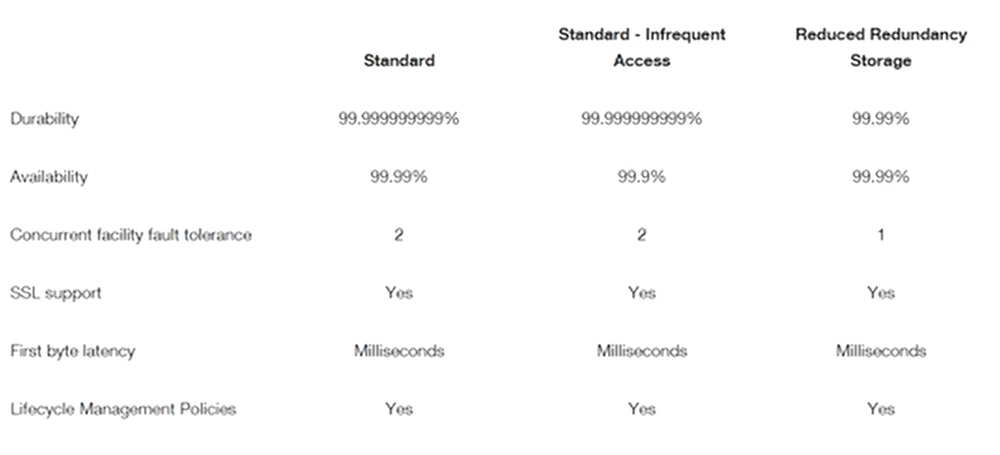
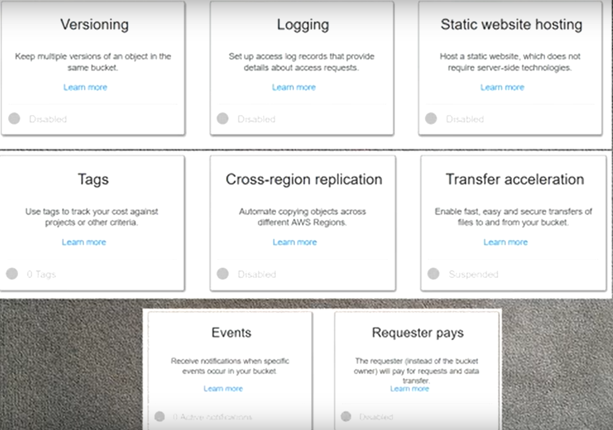

# Amazon
## Buckets
Buckets - хранилища в которых могут храниться файлы.  
Имя бакета должно быть уникальным.  
В buckets можно создавать подкаталоги (folders), а также загружать файлы (upload)
Также имеется возможность изменить storage class для каждого конкретного файла, сменить encryption, добавить теги, сменить права доступа к файлу, и многое другое.  



## Типы хранения файлов/объектов (storage classes)
Amazon S3 (Simple Storage Service) предоставляет различные классы хранения файлов/объектов, каждый из которых оптимизирован для определенных случаев использования. Вот основные типы хранения файлов/объектов в Amazon S3:  
* **Standard Storage:** (Стандартное хранение) (основное 1)
Это тип хранения по умолчанию. Объекты хранятся на нескольких устройствах в нескольких доступных зонах. Он обеспечивает высокую доступность и долговечность данных, но имеет более высокую стоимость по сравнению с другими типами хранения.

* **Intelligent-Tiering:** (Умное хранение) 
Этот класс автоматически перемещает объекты между частотами доступа "Часто доступно" и "Редко доступно" на основе паттернов доступа. Он позволяет сэкономить деньги, оптимизируя расходы на хранение в зависимости от использования данных.

* **One Zone-IA (Infrequent Access):** (Хранение в одной зоне, редкая доступность) (основное 2)
В этом классе объекты хранятся в одной доступной зоне (одной из доступных зон данных), что делает его более дешевым, чем стандартное хранение, но менее устойчивым к потере данных, так как он не обеспечивает репликацию в других зонах.

* **Glacier:** (Ледник)
Это хранилище для архивных данных, предоставляющее очень низкую стоимость хранения, но также включает дополнительные сроки доступа (обычно несколько часов) для извлечения данных.  
По сути является архивом, поэтому доступ не моментальный - направляется запрос, который обрабатывается от 3 до 5 часов, после чего их можно получить. Хорошо подходит, если требуется хранить данные длительного хранение (например 5-7 лет)

* **Glacier Deep Archive:** (Глубокий архив ледника)
Это еще более дешевый вариант для архивных данных, но с еще большими сроками доступа (обычно около 12 часов).  

* **Reduced Redundancy Storage** (Хранение с пониженной избыточностью): (основное 3)
Хранилище с пониженной избыточностью (RRS) – это вариант хранилища Amazon S3, который позволяет размещать некритичные и воспроизводимые данные в среде с пониженным (по сравнению со стандартным хранилищем Amazon S3) уровнем избыточности. Это решение с высокой доступностью для распространения или совместного использования контента, длительно хранящегося в другом месте, или для хранения миниатюр, перекодированных медиафайлов или других обрабатываемых данных, которые можно легко воспроизвести. В хранилище RRS объекты хранятся на нескольких устройствах, расположенных в нескольких ЦОД. Это обеспечивает уровень надежности данных, в 400 раз превышающий уровень надежности при использовании стандартных дисковых носителей. При этом RRS не создает такое количество копий объектов, как стандартное хранилище Amazon S3, что делает его еще более экономичным.  
Предусматривает надежность объектов на уровне 99,99 % и доступность объектов на уровне 99,99 % в течение определенного года. Такой уровень надежности соответствует средним ожидаемым годовым потерям объектов на уровне 0,01 %.  
Предназначено для обеспечения устойчивости при потере данных в одном объекте.  
https://aws.amazon.com/ru/s3/reduced-redundancy/  
  
Комбинация разных классов хранения может быть использована для оптимизации расходов и обеспечения требуемого уровня доступности.  
Тип данных можно переводить из одного в другой.


## Permissions.

### Access Control List:
Общие права доступа на бакет для Owner access, Public access и S3 log delivery group (возможность записывать в бакет логи, например логи доступа в какой-нибудь другой бакет).  

### Bucket policy:
В данном разделе мы можем описать в json формате необходимые политики для наших объектов в бакете.  
Также есть конструктор политик Policy generator.  
ARN - Amazon Resource Name (формат, в котором указывается имя бакета - Например, ```arn:aws:s3:::<bucket_name>```)  

### CORS configuration:  


## Properties.
### Versioning:
Настройка влияет на весь бакет сразу. Позволяет держать различные версии объектов в нашем бакете - при загрузке новых версий файлов, он всегда хранит все версии файлов. 
После его включения, его нельзя отключить, только приостановить (suspending).  
Следует помнить, что мы платим за размер файлов - бесплатно в год можно держать 5гб файлов в бакете на S3.  
Версии можно менять и, при необходимости, удалять. Также если файл был удалён целиком, можно его восстановить через опцию Deleted objects - восстановится он в той версии, в которой был в последний раз. Восстанавливать файлы, в бакете которого не был подключен Versioning, невозможно.

### Tags:
Теги добавляются в формате ключ-значение.

### Cross-region replication:
Позволяет сделать репликацию из основного бакета в одном регионе в другой, который находится в другом регионе.  
Для работы требуется включить Versioning на всех бакетах, которые будут участвовать в репликации, включая основной. Сам же Cross-region replication должен быть включен только на основном (target) бакете.  
Реплицировать можно либо весь бакет целиком, либо частично.  
При настройке необходимо создать IAM роль, которая даёт доступ к бакету, в который необходимо писать.  
Реплицироваться будут только те объекты, которые были добавлены в бакет после включения опции Cross-region replication.  
Репликация с более чем двумя бакетами не работает.  

### Logging:
Позволяет сохранять всё что происходит с бакетом.  
Для этого необходимо использовать два бакета в одном регионе - основной (target) и тот, в который будут записываться логи действий основного бакета.  
Логи появляются в районе часа.  

### Static website hosting:
Позволяет захостить статический вебсайт. При настройке требуется указать значения двух параметров:  
* Index document - страница, которая будет открываться при переходе на endpoint
* Error document - страница, которая будет открываться при ошибках (например, если не найден файл)  
Для корректной работы необходимо сделать все файлы бакета публично доступными (more > make public)


## Management.
Позволяет перевести объекты из одного storage class в другой.  
### Lifecycle:  
Позволяет перевести либо все объекты бакета, либо определённые (по prefix/tags) из одного storage class в другой через определённое время. Также можно настроить перевод в следующий storage class ещё спустя определённое время. Также можно настроить через сколько мы хотим стереть эти файлы.

### Analytics: 
### Metrics: 
### Inventory:

___

## CLI AWS
* cp
Команда ```aws cp``` используется для копирования файлов или директорий между вашим локальным компьютером и Amazon S3, а также между двумя папками в Amazon S3. Она предоставляет более простой способ копирования файлов и может быть использована для копирования как отдельных файлов, так и целых директорий. Пример использования:  
```aws s3 cp file.txt s3://my-bucket/```

* aws sync
Команда ```aws sync``` используется для синхронизации содержимого между локальной директорией и Amazon S3. Она копирует только те файлы, которые изменились с момента последней синхронизации. Таким образом, aws sync предназначена для поддержания актуальности данных между локальным хранилищем и хранилищем Amazon S3. Пример использования:  
```aws s3 sync локальная_директория s3://my-bucket/```  

Основное различие между aws cp и aws sync заключается в их предназначении. aws cp просто копирует файлы, тогда как aws sync сравнивает и синхронизирует директории, обеспечивая более сложную логику для поддержания согласованности данных между локальной системой и Amazon S3.

