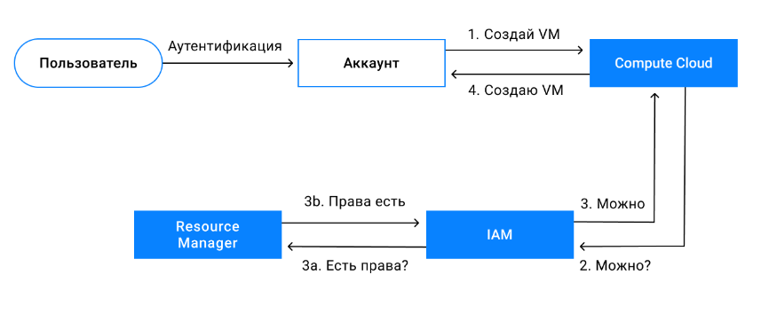
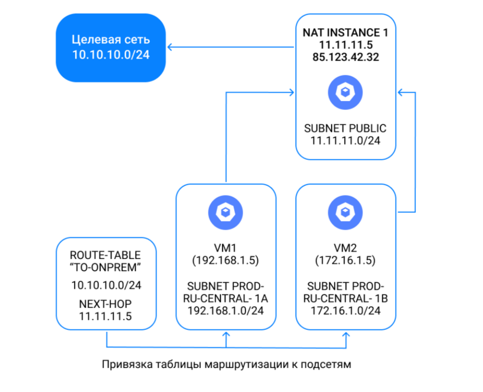
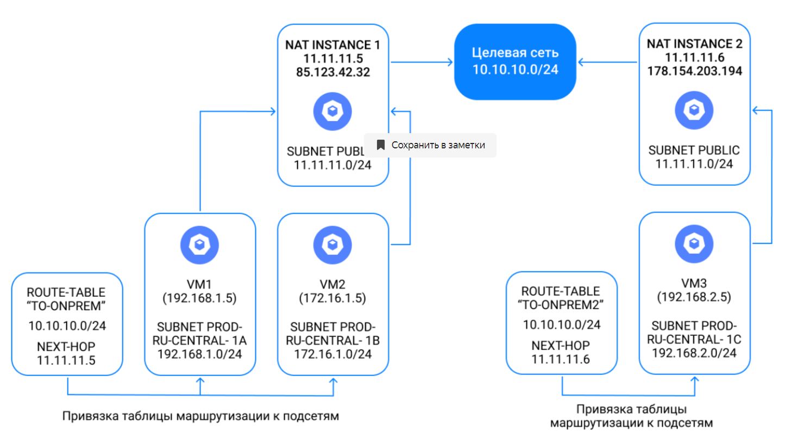

## Зона доступности
Инфраструктура Yandex Cloud состоит из трёх дата-центров. Они расположены в Подмосковье, Владимирской и Рязанской областях и связаны между собой собственными оптоволоконными сетями.  
  
С дата-центрами связано важное понятие — **зона доступности**, которая представляет собой независимый сегмент облачной инфраструктуры. В Yandex Cloud есть три зоны доступности: ```ru-central1-a```, ```ru-central1-b``` и ```ru-central1-c```. Каждая зона — это отдельный дата-центр. ДЦ полностью независимы друг от друга — сбой в одном из них не сказывается на работе остальных. Поэтому развернув своё приложение сразу в нескольких зонах доступности, вы заметно повысите его отказоустойчивость и снизите вероятность потери данных.  
  
## Иерархия ресурсов  
Ресурсы в Yandex Cloud — это все сущности, которые вы можете создать (виртуальные машины, диски, виртуальные сети). Ресурсы объединены в группы — **каталоги**. Каталоги объединены в облако. **Облако** — самая крупная логическая единица в Yandex Cloud. Она изолирована: ресурсы в облаке не могут взаимодействовать с ресурсами в другом облаке.  
  
## Роли
Сервис Yandex Resource Manager определяет ресурсную модель Yandex Cloud и позволяет структурировать ресурсы с помощью каталогов. С его помощью вы также можете назначить пользователю роли, определяющие, какие действия этот пользователь может выполнять с доступными ресурсами.  
  
**Роли бывают двух типов:**  
* **Примитивные роли** — содержат разрешения, действующие для всех типов ресурсов Yandex Cloud. Это роли admin, editor и viewer.
* **Сервисные роли** — содержат разрешения только для определенного типа ресурсов в указанном сервисе.
Примитивных ролей три. Они позволяют:  
  
| Роль | Просматривать информацию о ресурсах | Управлять ресурсами (создавать, изменять, удалять) | Настраивать доступ к ресурсам для других пользователей |
|--------|---|---|---|
| viewer  | + | - | - |
| editor  | + | + | + |
| admin   | + | + | + |
  
Сервисных ролей много, так как они сильно зависят от логики работы сервисов. Например, у **Yandex Resource Manager** есть две сервисные роли:  
* **resource-manager.clouds.owner** — назначается только на облако, даёт полный доступ к облаку и ресурсам в нём;
* **resource-manager.clouds.member** — роль необходима для доступа к ресурсам в облаке другим пользователям без административных прав.  
  
Вернёмся к иерархии **Облако → Каталог → Ресурс**. Роли в ней наследуются:
* **resource-manager.clouds.owner** может выполнять любые действия с любым ресурсом в любом каталоге;
* пользователь с ролями **resource-manager.clouds.member** на облако и **editor** на облако может управлять любыми ресурсами в любом каталоге;
* **editor** каталога может управлять ресурсами только в своём каталоге.  
  
У каждого облака обязательно должен быть хотя бы один владелец (**owner**). У пользователя может быть роль **owner** в нескольких облаках.  
  
## Пользователи
Пользователем называется человек или программа, которые взаимодействуют с ресурсами. Пользователи идентифицируются с помощью аккаунтов.  
В Yandex Cloud есть три типа аккаунтов, с помощью которых можно авторизоваться для доступа к ресурсам:
* **Яндекс ID** — единый аккаунт человека во всех сервисах Яндекса;
* **Федеративный аккаунт** — аккаунт человека во внешних по отношению к Яндексу системах, которые поддерживают технологии аутентификации. Например, аккаунт в **Microsoft Active Directory** — популярной системе хранения информации о корпоративных пользователях;
* **Сервисный аккаунт** — аккаунт, от имени которого программы могут управлять ресурсами.  
  
Сервис **Yandex Identity and Access Management (IAM)** проверяет права пользователей на действия с ресурсами. Проверка прав называется авторизацией.  
Чтобы пользователь подтвердил личность, он должен пройти аутентификацию. Её способы зависят от типа аккаунта. Например, с **Яндекс ID** аутентификация происходит автоматически. **Сервисные аккаунты** аутентифицируются с помощью **IAM-токена**, **API-ключей** или **статических ключей доступа**.   
Для примера посмотрим на последовательность работы **Yandex Cloud** при создании ВМ.  
  
  
## Платёжный аккаунт  
**Платёжный аккаунт** используется для идентификации пользователя, оплачивающего ресурсы. Он хранит информацию о плательщике и может быть не связан напрямую с конкретным человеком. С точки зрения **Resource Manager** платежный аккаунт — это ресурс. К нему можно давать доступ обычным аккаунтам, используя роль **billing.accounts.member**.  
Платёжный аккаунт может оплачивать ресурсы нескольких облаков. Облако может быть привязано только к одному платёжному аккаунту.  
**Платёжный аккаунт хранит следующую информацию:**  
* **Лицевой счёт** — уникальный идентификатор. Используется для оплаты ресурсов во время действия договора. Содержит средства, зачисленные с помощью банковской карты или банковского перевода;
* **Способ оплаты** — способ, которым вы можете зачислять средства на лицевой счёт.  
  
**Лицевой счёт создается автоматически, а способ оплаты зависит от типа платёжного аккаунта:**  
|   | Для кого предназначен | Способ оплаты | Документы об оплате, которые вы получите на email |
|---|-----------------------|---------------|---------------------------------------------------|
| Личный аккаунт | Физические лица — резиденты России или Казахстана* | Банковская карта | Чек |
|Бизнес-аккаунт | Юридические лица: резиденты и нерезиденты России | Перевод с расчётного счёта или корпоративной банковской карты | Акт и счёт |  
  
Yandex Cloud не работает с физическими лицами — нерезидентами России и Казахстана.  
  
Остановленные ВМ тарифицируются, поскольку загрузочный диск занимает пространство в хранилище. Однако остановленная ВМ будет обходиться гораздо дешевле работающей.  
  
## Подключение по SSH к серийной консоли
```ssh -t -p 9600 -o IdentitiesOnly=yes -i ~/.ssh/<имя закрытого ключа> <ID виртуальной машины>.<имя пользователя>@serialssh.cloud.yandex.net```  
Перед этим необходимо задать пароль текущему пользователю:  
```sudo passwd <имя_пользователя>```  
Чтобы отключиться от серийной консоли, нажмите клавишу Enter, а затем введите символы ```~.``` (тильда и точка). В терминалах Linux для отключения также можно использовать комбинацию клавиш Ctrl + D.  
  
## Прерываемые машины и уровни производительности
Один из параметров, который задаётся при создании ВМ, — это уровень производительности vCPU. Он определяет доступную ВМ долю вычислительного времени физических ядер.
* ВМ с уровнем производительности 100% имеют непрерывный (100% времени) доступ к вычислительной мощности физических ядер. Такие ВМ предназначены для запуска приложений, требующих высокой производительности на протяжении всего времени работы.
* ВМ с уровнем производительности меньше 100% имеют доступ к вычислительной мощности физических ядер как минимум на протяжении указанного процента от единицы времени. Такие ВМ предназначены для запуска приложений, не требующих высокой производительности и не чувствительных к задержкам. Они обойдутся дешевле.  
  
Для многих задач не требуется, чтобы виртуальная машина (ВМ) была доступна постоянно.  
Например, вы настроили Jenkins для тестирования сборок (непрерывной интеграции) приложения. Изменения интегрируются несколько раз в день. Соответственно, ВМ использует ресурсы в полной мере лишь эти несколько раз в день, а в остальное время — простаивает. Получается, вы платите за постоянно доступную ВМ, хотя она вам не нужна.  
В этом случае разумно создать прерываемую ВМ. Вкратце её суть такова: вы получаете вычислительные ресурсы за меньшую цену, но они могут быть отозваны в любое время.  
Yandex Cloud остановит прерываемую ВМ, если:
* Обычным ВМ в той же зоне доступности не хватает ресурсов. Такое происходит, когда в этой зоне доступности быстро создаётся много обычных ВМ. Например, если появляется пользователь с обширными потребностями или пользователи массово масштабируются.
* С запуска прерываемой ВМ прошло больше 24 часов. Чтобы не перезапускать ВМ вручную каждый день, доверьтесь автоматике (например, сервису групп ВМ, о котором мы расскажем позже).  
  
После остановки ВМ не удаляется, все её данные сохраняются.  
Соглашение об уровне обслуживания (Service Level Agreement, или SLA) не распространяется на прерываемые ВМ. Вы можете запустить их вновь, только если в зоне доступности достаточно ресурсов. Поэтому прерываемые ВМ не подходят для решений, где требуется постоянная работа и отказоустойчивость.  
  
Виртуальную машину можно сделать прерываемой при её создании. Второй способ — изменить тип обычной ВМ, предварительно её остановив.  
  
Вот ещё несколько задач, для которых подходят прерываемые ВМ:  
* **Пакетная обработка данных**  
Обычно такие задания обрабатываются параллельно, процессом управляет оркестратор. Если прерываемая ВМ выключится, задание получит следующий исполнитель.  
* **Повышение производительности веб-сервисов при пиковых нагрузках**  
Когда посещаемость сайта резко возрастает, вам нужно на время подхватить нагрузку дополнительными ресурсами. Прерываемые ВМ отлично справятся с этой задачей. Важно включить в состав кластера и обычные ВМ, которые станут работать при стандартных нагрузках.  
* **Проекты на Kubernetes**  
Оркестратор Kubernetes позволяет автоматизировать развёртывание и масштабирование контейнеризированных приложений и управление ими. Базовая единица управления Kubernetes — под. Под отвечает за запуск одного или нескольких контейнеров на узле. Планировщик Kubernetes подбирает и назначает узел для каждого пода. Если узел с запущенным подом выйдет из строя, планировщик автоматически перенесёт под на работающий узел. Поэтому некоторые узлы можно размещать на прерываемых ВМ.  
  
  
## Сервис метаданных и cloud-init
С каждой ВМ в Compute Cloud связаны метаданные.  
**Метаданные** — это идентификатор, название и описание ВМ, список подключённых к ней дисков и сетевых интерфейсов, привязанные к ВМ сервисные аккаунты. Кроме того, вы можете определять дополнительные метаданные и указывать их, когда создаёте или изменяете ВМ.
Получайте метаданные изнутри ВМ с помощью сервиса метаданных (он доступен из любой ВМ по адресу http://169.254.169.254) и используйте их для настройки машины или софта на ней. Например, укажите через метаданные, в каком режиме запуститься приложению на сервере: в отладочном или в боевом. Меняйте режим, не заходя на сервер, просто меняя значение в сервисе метаданных.  
Сервис возвращает метаданные в двух форматах: **Google Compute Engine** или **Amazon EC2**.  
Помните, что в Yandex Cloud поддерживаются не все поля этих форматов.  
В ВМ на базе **Linux** для работы с метаданными, как правило, используется агент **cloud-init**, в машинах с **Windows** — **Cloudbase-Init**. Но вы можете отправить запрос в сервис метаданных и самостоятельно — с помощью любого HTTP-клиента.  
Вы можете передать метаданные при создании и изменении ВМ. Чаще всего это делается с помощью консольной утилиты **Yandex Cloud CLI**.  
Указывайте метаданные в CLI в одном из трёх параметров:  
* ```--metadata``` принимает список пар «ключ=значение», разделённых запятой, например: ```--metadata foo1=bar,foo2=baz```.
* ```--metadata-from-file``` читает метаданные из файла, например: ```--metadata-from-file key=path/to/file```. Этот метод удобен, чтобы передавать длинные метаданные.
* ```--ssh-key``` — специальный тип метаданных для хранения публичного SSH-ключа. Доступен только для ВМ на Linux, где его читает агент cloud-init.  
  
Чтобы получить метаданные ВМ от Yandex Cloud, вы можете использовать интерфейс командной строки **Yandex Cloud (CLI)** или **API**.  
Пошаговое руководство по использованию CLI для решения этой задачи приведено в [документации](https://cloud.yandex.ru/docs/compute/operations/vm-info/get-info).  
  

## Диски
Объём и тип диска влияют на производительность. Ключевое понятие здесь — блок размещения, т. е. единица выделения дискового пространства. Чем больше блоков размещения в вашем диске, тем более производительный диск в итоге вы получаете. У сетевых SSD размер блока размещения — 32 ГБ, у сетевых HDD он равен 256 ГБ. Поэтому при одинаковом объёме у SSD больше блоков размещения, а значит, выше IOPS (количество операций чтения и записи, выполняемых диском в секунду) и пропускная способность. Таким образом производительность диска будет расти ступенчато с увеличением количества блоков размещений в нем. Блоки размещения в разных типах дисков отличаются размером и лимитами на производительность, которые указаны [здесь](https://cloud.yandex.ru/docs/compute/concepts/limits#compute-limits-disks).  
  
### Загрузочные и дополнительные диски
Данные ВМ в Compute Cloud хранятся на загрузочном и дополнительных дисках. На загрузочном диске находится операционная система и приложения, поэтому его нельзя отключить от ВМ. На дополнительном диске вы можете хранить любые данные, его можно отключить от одной ВМ и подключить к другой.  
Например, ваш веб-сервис хранит пользовательскую информацию в базе данных и может создавать выгрузки в удобном пользователю формате. В таком случае на загрузочном диске будет только само веб-приложение поверх операционной системы, а база данных и файлы выгрузки — на дополнительных дисках.  
  
## Снимки
Важно! Останавливайте операции с диском, перед тем как создать снимок (например, в ОС Linux вы можете [остановить все операции записи на диск в приложениях](https://cloud.yandex.ru/docs/compute/operations/disk-control/create-snapshot#prepare), или просто [остановить](https://cloud.yandex.ru/docs/compute/operations/vm-control/vm-stop-and-start#stop) ВМ с любой ОС). Если работающее в ВМ приложение создаёт или меняет файлы на диске — в снимок могут попасть неполные, повреждённые файлы. При восстановлении из снимка может нарушиться целостность данных.  
**Когда снимок готов, проверьте его целостность:** создайте ВМ из снимка и проверьте, как она работает. Подробнее об этом мы расскажем в следующем практическом задании.
Вы можете создавать сколько угодно снимков. Их хранение оплачивается дополнительно. Чтобы вы проще различали снимки, по умолчанию в их название включается имя диска. Например, disk2-1614952835886 снят с диска disk2, а 1614952835886 — это отметка времени Unix, когда был создан снимок.  
**Между репликацией дисков и репликацией снимков есть важное отличие.** Диск находится в одной зоне доступности и реплицируется только внутри нее (кроме [нереплицируемых дисков](https://cloud.yandex.ru/docs/compute/concepts/disk#disks-types)). Снимки же реплицируются во все зоны доступности. Поэтому чтобы перенести ВМ в другую зону, достаточно создать в этой зоне копию ВМ из снимка загрузочного диска.  

### Создаем снимок диска ВМ
В первую очередь обеспечьте целостность данных. Для этого подключитесь к ВМ по SSH и выполните команду ```sync```, чтобы записать кеш операционной системы на диск (иначе изменения файлов, хранящиеся в оперативной памяти, будут потеряны).
  
Диски в Linux монтируются в ОС в виде файлов. Чтобы узнать нужный файл устройства диска, выполните команду ```df -h``` для вывода полного списка устройств и соответствующих точек монтирования. Затем, чтобы заморозить файловую систему, запустите команду ```sudo fsfreeze --freeze <точка_монтирования>```.  
  
В консоли управления откройте раздел **Compute Cloud** и перейдите на вкладку Диски. Справа от диска нажмите ```...``` и выберите ```Создать снимок```.  
Как только снимок будет создан, статус операции сменится с Creating на Ready.  
Разморозьте файловую систему. Для этого в командной строке с интерфейсом подключения к ВМ по SSH выполните команду ```sudo fsfreeze --unfreeze <точка монтирования>```.  

### Восстановление из снимка
Поскольку снимок создан с загрузочного диска, который всегда подключён к ВМ, для восстановления создайте новую ВМ вместо старой. При создании загрузочного диска машины выберите готовый снимок диска. Для этого в блоке Выбор образа/загрузочного диска перейдите на вкладку Пользовательские и нажмите кнопку Выбрать. В открывшемся окне перейдите на вкладку Снимок, выберите нужный снимок и нажмите кнопку Применить.  
Дождитесь завершения создания и запуска новой ВМ. Теперь старую ВМ можно остановить и удалить.  
Будьте внимательны при создании новых виртуальных машин: в облаке действуют [квоты и лимиты](https://cloud.yandex.ru/docs/overview/concepts/quotas-limits) на используемые ресурсы.

### Образы и публичные образы
Предположим, вы разработали первую версию веб-сервиса и готовитесь открыть его для пользователей. В ВМ уже отлажено рабочее окружение для приложения, выверены настройки служб. Осталось её реплицировать, чтобы сервис оставался доступен, даже если возникнут неполадки.  
Вы можете развернуть ВМ из снимка диска или из образа. Образы и снимки, созданные в одной зоне доступности, доступны и в других.  
  
Образы оптимальны для распространения программного обеспечения, например дистрибутивов операционных систем (ОС) или дисков с установленными программами. В основном образы используются, чтобы быстро создать загрузочный диск ВМ. Ваш сервис — это как раз дистрибутив ОС с предустановленными и настроенными приложениями.  
Создание ВМ из образа происходит быстрее, чем из снимка диска. **Выбирайте образы, когда важна скорость!** Например, если пользовательская база стремительно растёт — для распределения нагрузки надо добавлять ВМ как можно быстрее, чтобы приложение работало бесперебойно.  

#### Использование готовых образов  
Если вы только начинаете разработку — в качестве отправной точки для создания веб-сервиса в Compute Cloud можете использовать ВМ на базе готового образа ОС (Ubuntu, Fedora, CentOS и др.). Вы получите полнофункциональную систему и настроите её так, как хотите. Список образов ОС вы увидите при создании ВМ в блоке Выбор образа/загрузочного диска на вкладке Операционные системы.  
Кроме того, в [Cloud Marketplace](https://cloud.yandex.ru/marketplace) доступны образы с предустановленными приложениями. Например, если сервис будет хранить данные в базе данных Postgres — создайте ВМ с предустановленной Postgres Pro Enterprise Database, работающей поверх Debian.  
  
#### Перенос локальной ВМ в Compute Cloud
Если вы разрабатываете сервис на рабочей станции в локальной ВМ, то можете перенести машину в Compute Cloud. Для этого подготовьте файл образа ВМ (поддерживаются образы форматов **Qcow2**, **VMDK** или **VHD**) и загрузите его в бакет **Yandex Object Storage**, после чего он станет доступен при создании ВМ.  
  
#### Создание публичных образов  
Чтобы пользователи Yandex Cloud могли создавать ВМ и диски с помощью вашего образа, нужно открыть к нему доступ и он станет публичным. Это делается не из консоли управления, а из интерфейса командной строки Yandex Cloud CLI.  
  
  
## Сеть  
### Сети и подсети  
Физические серверы в дата-центрах соединяются друг с другом с помощью сети. Виртуальным серверам тоже нужно общаться друг с другом, поэтому для них поверх физической сети построена своя, виртуальная сеть. Она гарантирует, что нужные виртуальные машины смогут передавать данные друг другу, выходить в интернет и подключаться к базам данных, при этом владельцы «соседних» виртуальных машин не смогут увидеть этот трафик или повлиять на него.  
Чтобы соединить несколько виртуальных машин, нужно создать облачную сеть. Ресурсы типа виртуальных машин и баз данных, находящиеся в одной облачной сети, по умолчанию «видят» друг друга, а находящиеся в разных сетях — нет. Кроме облачной сети, надо создать ещё и подсети — подмножество сети в конкретной зоне доступности. По умолчанию создаётся по одной подсети для каждой зоны, но вы можете этим управлять, если захотите.  
  
### IP адреса
При создании подсети вы можете выбрать, какие IP-адреса будут выдаваться устройствам в этой подсети. Для этого можно выбрать любой диапазон адресов, вложенный в один из следующих: 10.0.0.0/8, 172.16.0.0/12 и 192.168.0.0/16. Это не случайные диапазоны: они зафиксированы в стандарте [RFC1918](https://datatracker.ietf.org/doc/html/rfc1918) как немаршрутизируемые в интернете и используются только в локальных сетях.  
Стоит учесть, что:  
* Допустимая длина префикса варьируется от /16 до /28. Подсеть 10.0.0.0/17 создать можно, а 10.0.0.0/15 или 10.0.0.0/29 — нет.
* Первые два адреса подсети выделяются под шлюз (x.x.x.1 для маски сети /24) и DNS-сервер (x.x.x.2 для маски сети /24). Использовать их для виртуальных машин или других ресурсов не получится.
* Внутри одной облачной сети диапазоны IP-адресов всех подсетей не должны пересекаться. В то же время подсети разных облачных сетей могут пересекаться по IP-адресам, ведь две разные сети изолированы друг от друга.
* В Yandex Cloud пока используются только IPv4-адреса. Поддержка IPv6 планируется в будущем.  
  
Внутренние IP-адреса не меняются в течение всего времени существования облачного ресурса. При создании виртуальной машины или другого ресурса их можно задать вручную, или они будут выбраны автоматически в выбранной подсети.  
Кроме внутреннего адреса, вы можете выдать виртуальной машине или базе данных также и публичный IP-адрес. Он будет уже принадлежать маршрутизируемому диапазону (например 130.193.32.0/19), и благодаря этому адресу облачные ресурсы могут обмениваться данными с интернетом и с ресурсами из других облачных сетей. Публичные адреса сопоставляются с внутренними адресами ресурсов с помощью так называемого one-to-one NAT, т.е. одному внешнему адресу соответствует один ресурс в конкретной облачной сети.  
  
### Создание новой сети с подсетями и ВМ
Облачные сети (сервис **Virtual Private Cloud** или **VPC**) являются частью публичного облака, которая связывает пользовательские, инфраструктурные, платформенные и прочие ресурсы воедино, где бы они ни находились — в нашем облаке или за его пределами. При этом VPC позволяет не публиковать эти ресурсы в интернете без необходимости, они остаются в пределах вашей изолированной сети.  
Когда вы создаёте облако, в нём автоматически создаются сеть **default** и подсети в каждой зоне доступности. Но иногда их бывает недостаточно. В этой практической работе вы научитесь создавать облачную сеть и добавлять подсети самостоятельно.  
Рассмотрим пример, как настроить облачную сеть, чтобы организовать работу сервера с доступом из интернета. Сначала создадим единую для всех ресурсов облака изолированную сеть с подсетями и виртуальной машиной.  
  
1. В консоли управления перейдите на страницу сервиса **Virtual Private Cloud** (Дашборд каталога → Virtual Private Cloud) и нажмите кнопку Создать сеть вверху справа.  
Введите имя сети (пусть она называется ```yc```), поле Описание заполнять необязательно. Оставьте выбранной опцию Создать подсети и нажмите кнопку Создать сеть.  
В результате будут созданы сеть **yc** и три подсети: ```yc-ru-central1-a```, ```yc-ru-central1-b``` и ```yc-ru-central1-c```.  
2. Для сервера создадим ещё одну подсеть с маской ```/28```. Перейдите на страницу сети **yc** (Дашборд каталога → Virtual Private Cloud → сеть yc) и нажмите кнопку Добавить подсеть.  
Введите параметры подсети: Имя — ```yc-public```, Зона — ```ru-central1-a```, CIDR — ```192.168.0.0/28```. Нажмите кнопку Создать подсеть.  
3. Доступом пользователей облака к сетевым ресурсам управляют с помощью [назначения ролей](https://cloud.yandex.ru/docs/vpc/security/).  
4. Теперь создайте ВМ с именем ```web-server``` и ОС Ubuntu 22.04. Убедитесь, что в блоке **Базовые параметры** выбрана зона доступности ```ru-central1-a```. В блоке **Сетевые настройки** выберите Подсеть ```yc-public```. В блоке **Доступ** введите логин пользователя (например ```user```) и вставьте открытый SSH-ключ в соответствующее поле.  
Чтобы ВМ полноценно заработала, для неё нужно организовать доступ в интернет. Есть три способа:  
* Назначить ВМ публичный IP-адрес. Для этого выберите автоматический способ назначения IP-адреса, когда создаёте ВМ, или [привяжите его к уже созданной](https://cloud.yandex.ru/docs/compute/operations/vm-control/vm-attach-public-ip).
* Использовать [NAT-шлюз](https://cloud.yandex.ru/docs/vpc/concepts/gateways#nat-gateway), который позволяет дать ВМ доступ в интернет без назначения ей публичного IP-адреса. Самому шлюзу адрес выделяется из отдельного диапазона публичных IP-адресов.  
* Использовать **NAT-инстанс** — отдельную ВМ со статическим публичным IP-адресом и настроенными правилами маршрутизации трафика.  
С точки зрения безопасности лучше выбирать **второй** или **третий** способ. В этом примере для упрощения присвойте ВМ публичный IP-адрес — в поле Публичный адрес выберите опцию Автоматически.  
5. После создания ВМ проверьте её доступность, чтобы убедиться в том, что сетевая конфигурация настроена правильно. Для этого перейдите на страницу **Обзор** созданной ВМ (**Дашборд каталога → Compute Cloud → ВМ web-server**) и в блоке **Сеть** найдите её публичный IP-адрес.  
  
Такая конфигурация подходит для небольшого веб-сервера. Если вы собираетесь строить озеро данных или обрабатывать математические вычисления, не рекомендуется давать к ресурсам прямой доступ из интернета — **разместите их за NAT**.  
  
### Публичные IP-адреса
Если по внутреннему IP-адресу ВМ доступна только внутри облачной сети, то по публичным IP (они же белые или внешние) она видна и внешнему миру.  
Публичный IP-адрес:  
* Присваивается по умолчанию при создании облачного ресурса с публичным адресом, если выставлены соответствующие настройки.
* По умолчанию динамический (каждый раз новый при запуске ресурса), но его можно сделать статическим.  
  
Динамические IP-адреса освобождаются при остановке ресурса и сохраняются при перезагрузке. Статические IP сохраняются при остановке ресурса. Их можно зарезервировать и использовать позже, даже если они не привязаны к ресурсу.  
Публичные IP-адреса с ресурсами, к которым они привязаны, перечислены в консоли управления в разделе **Virtual Private Cloud** на вкладке **IP-адреса**. Эта вкладка доступна в двух случаях:  
1. У вас есть ВМ с публичными адресами.
2. У вас есть статические публичные IP-адреса.
  
### Статические IP-адреса
Чтобы на ВМ работал сервис, постоянно доступный по одному и тому же публичному IP-адресу, **поменяйте динамический IP на статический**:  
1. В списке публичных IP-адресов найдите адрес нужной ВМ.
2. Справа нажмите ```...``` и в раскрывшемся списке выберите **Сделать статическим**.
3. Остановите и снова запустите ВМ. Вы увидите, что публичный IP-адрес остался прежним.  
  
### Статическая маршрутизация
С помощью статической маршрутизации вы можете направлять трафик из подсети на заданные диапазоны IP-адресов через ВМ, указанные в качестве [шлюза](https://en.wikipedia.org/wiki/Hop_(networking)#Next_hop) (next hop). Для этого используются таблицы маршрутизации. Они содержат статические маршруты, состоящие из префикса целевой подсети в нотации [CIDR](https://ru.wikipedia.org/wiki/%D0%91%D0%B5%D1%81%D0%BA%D0%BB%D0%B0%D1%81%D1%81%D0%BE%D0%B2%D0%B0%D1%8F_%D0%B0%D0%B4%D1%80%D0%B5%D1%81%D0%B0%D1%86%D0%B8%D1%8F) и внутреннего IP-адреса шлюза.  
  
#### Создать таблицу маршрутизации
Чтобы создать таблицу маршрутизации со статическим маршрутом, в консоли управления в разделе **Virtual Private Cloud** перейдите на страницу облачной сети, слева выберите вкладку **Таблицы маршрутизации** и нажмите кнопку **Создать таблицу маршрутизации**.  
Укажите название таблицы, добавьте статический маршрут и нажмите кнопку **Создать таблицу маршрутизации**.  
Таблица маршрутизации привязывается к подсети и не может содержать повторяющихся префиксов. Трафик из подсети с привязанной таблицей будет направляться к указанным в маршрутах префиксам через соответствующий адрес шлюза.  
Префикс ```0.0.0.0/0``` в маршруте означает, что весь трафик, если он не направлен по другим маршрутам, будет направлен через указанный для этого префикса шлюз.  
Например, к подсети с CIDR ```10.1.0.0/24``` привязана таблица маршрутизации с такими маршрутами:  
| Имя             | Префикс        | Шлюз      |
|-----------------|----------------|-----------|
| another-network | 192.168.0.0/16 | 10.1.0.5  |
| internet        | 0.0.0.0/0      | 10.1.0.10 |  
  
В этом случае весь трафик в подсеть ```192.168.0.0/16```, которая находится в другой виртуальной сети, будет направляться через ВМ с адресом ```10.1.0.5``` — при условии, что у ВМ есть интерфейс в другой виртуальной сети. Весь остальной трафик — через ВМ ```10.1.0.10```. При этом переопределение маршрута для префикса ```0.0.0.0/0``` может повлиять на внешнюю доступность ВМ из подсети с таблицей, где есть такой маршрут.  
В Yandex Cloud поддерживаются только префиксы назначения вне виртуальной сети (например, префиксы подсетей другой сети Yandex Cloud или вашей локальной сети).  
При создании маршрута в качестве шлюза можно указать свободный внутренний IP-адрес, который не привязан ни к одной ВМ. В этом случае маршрут заработает, когда будет запущена ВМ с соответствующим IP-адресом.  
  
#### Для чего используются статические маршруты  
Есть две типичные схемы использования статических маршрутов в Yandex Cloud:  
1. Сетевой маршрут строится до нужного префикса через одну ВМ. В качестве шлюза используется внутренний IP-адрес NAT INSTANCE 1
  
2. Отказоустойчивая схема с маршрутами в нескольких зонах доступности. Создайте ВМ в разных зонах доступности и проложите через них маршруты до одной подсети назначения. Если ВМ в одной зоне выйдет из строя — у ВМ из других зон сохранится связность с подсетью назначения.  
  
  
### Изменение маршрутов трафика в интернет  
Если в префиксе назначения у маршрута из таблицы маршрутизации указан префикс адресов из интернета, то доступ к таким адресам и с таких адресов станет невозможным через публичные IP-адреса ВМ из подсетей, к которым привязана эта таблица.  
  
Допустим, есть машина ```vm-1``` с публичным IP-адресом, подключенная к подсети ```my-subnet```. Если к подсети ```my-subnet``` привязать таблицу ```my-route-table``` с маршрутом для префикса ```0.0.0.0/0``` (все адреса) через шлюз ```10.0.0.5```, то доступ через публичный адрес к vm-1 пропадёт. Это произойдёт потому, что весь трафик в подсеть ```my-subnet``` и из неё теперь будет направляться через адрес шлюза (см. первую схему).  
Чтобы сохранить входящую связность с облачными ресурсами через публичный адрес, вы можете:  
* вынести ресурсы с публичными адресами в отдельную подсеть;
* вместо настройки маршрута в интернет включить для подсети доступ в интернет через NAT (функция находится на стадии Preview и включается по запросу в техподдержку).  
  
## Группы безопасности  
Группы безопасности выполняют функцию межсетевого экрана и позволяют контролировать входящий и исходящий трафик ВМ.  
В консоли управления этот инструмент находится в разделе **Virtual Private Cloud**. Чтобы переключиться на него, нужно нажать кнопку **Группы безопасности** (значок щита) в панели слева.  
Если в вашем облаке групп безопасности ещё нет, эта кнопка может не отображаться в интерфейсе. В этом случае для создания группы перейдите по ссылке https://console.cloud.yandex.ru/link/vpc/security-groups. После того как первая группа безопасности будет создана, кнопка Группы безопасности появится на боковой панели каждой облачной сети.  
Группа безопасности назначается сетевому интерфейсу при создании или изменении ВМ и содержит правила получения и отправки трафика.  
**👉 Главный принцип: запрещено всё, что не разрешено явно.**  
Поэтому, если назначить сетевому интерфейсу ВМ группу безопасности без правил, ВМ не сможет передавать и принимать трафик и у вас не получится зайти на неё по SSH.  
  
### Правила  
Нажмите кнопку **Создать группу** и добавьте для неё правила: определите протоколы и IP-адреса для приёма и отправки трафика.  
Если сетевому интерфейсу ВМ назначены несколько групп безопасности, то учитываются правила из всех групп. В этом случае на ВМ поступит трафик, который подпадает хотя бы под одно из правил в группах.  
Правила также хранят состояния сессий. Группы безопасности отслеживают состояние соединений и сопоставляют трафик ответа с уже открытой сессией, чтобы разрешить его приём.  
Например, правило позволяет ВМ создать исходящую сессию на 80-й порт какого-либо IP-адреса. Ответы от 80-го порта на порт источника, откуда отправлялся запрос, будут автоматически разрешены.  
  
### Виды правил  
* **Для входящего трафика.** Определяют диапазоны адресов и портов или другие группы безопасности, откуда ВМ могут принимать трафик.
* **Для исходящего трафика.** Определяют диапазоны адресов и портов или другие группы безопасности, куда ВМ могут отправлять трафик.  
  
Если в группе безопасности есть правила только для исходящего трафика, но нет для входящего — ответный трафик будет поступать на ВМ. А если есть правила только для входящего трафика, ВМ сможет лишь отвечать на запросы, но не инициировать их.  
Если две ВМ находятся в одной группе безопасности без правил, они не смогут обмениваться трафиком. Выберите любое решение:  
* Используйте правило ```Self``` для всей группы. Оно разрешает любой трафик между ресурсами, которые относятся к одной и той же группе безопасности.
* Точно укажите адреса и порты ресурсов в правилах.  
  
### IP-адреса и диапазоны адресов  
В правилах вы можете разрешать прием и отправку трафика на IP-адреса или диапазоны адресов. Указывайте конкретный IP-адрес в правилах с помощью СIDR с маской ```/32```.  
Чтобы разрешить передачу трафика на любые адреса по любым протоколам, укажите CIDR ```0.0.0.0``` с маской ```/0``` и в поле выбора протокола выберите **Любой**.  
Группы безопасности не блокируют отправку трафика на адреса сервисов, необходимых для работы ВМ и виртуальной сети. Это:  
* Адрес сервера метаданных — ```169.254.169.254```.
* Адрес DNS-сервера — второй по порядку внутренний IP-адрес (обычно ```x.x.x.2```) в каждой подсети.  
  
Чтобы сетевой балансировщик мог проверять состояние подключённых к нему ресурсов, разрешите передачу трафика между диапазонами адресов ```198.18.235.0/24``` и ```198.18.248.0/24``` и целевыми ресурсами.  
  
### Параметры по умолчанию  
Если не указано иное, группа безопасности автоматически создаётся в новой сети и назначается ВМ при подключении к подсетям новой сети, если у них нет ни одной группы безопасности.  
При этом группа безопасности автоматически создаётся с рядом правил. Разрешён любой исходящий трафик. Для входящего трафика разрешены:  
* любой входящий трафик от членов той же группы безопасности;
* SSH-соединения на порт 22 (протокол TCP) с любых адресов (0.0.0.0/0);
* RDP-соединения на порт 3389 (протокол TCP) с любых адресов (0.0.0.0/0);
* любой входящий трафик по протоколу ICMP с любых адресов (0.0.0.0/0).  
  
Группу безопасности, созданную по умолчанию, невозможно удалить.  
  
### Практическая работа. Создаем группу безопасности и открываем доступ к серверу  
Давайте попробуем создать группу безопасности и сделать доступными страницы, предоставляемые веб-сервером NGINX.  
1. Перейдите по ссылке https://console.cloud.yandex.ru/link/vpc/security-groups и нажмите кнопку **Создать группу**.
2. Введите имя группы ```yc-security``` и выберите сеть ```yc``` (вы создали её на одном из предыдущих практических занятий).  
3. В блоке **Правила** добавьте правила для исходящего трафика. Опишите правило, укажите диапазон портов ```80``` (```HTTP```) и протокол ```TCP```, выберите назначение "```CIDR```" ```0.0.0.0/0```. Создайте аналогичные исходящие правила для портов ```443``` (```HTTPS```) и ```22``` (```SSH```). Для входящего трафика добавьте правила для ```80``` и ```22``` портов, чтобы подключаться к веб-серверу и управлять ВМ извне.  
Вы увидите созданную группу в списке групп безопасности.  
Если инициировано соединение по определенному порту и протоколу с ВМ и есть исходящее правило, то значит и на входящий трафик будет разрешена передача данных в эту же сеть, на этот же протокол и порт.  
Если назначить сетевому интерфейсу ВМ группу безопасности без правил, ВМ не сможет передавать и принимать трафик.  
4. Создайте виртуальную машину на базе Ubuntu 20.04, выберите сеть ```yc``` и вновь созданную группу безопасности ```yc-security``` в сетевых настройках создаваемой ВМ, дождитесь запуска машины, подключитесь к ВМ по SSH и установите веб-сервер NGINX (по умолчанию он отсутствует). Для этого выполните команду:  
```sudo apt-get install nginx```  
5. Установка возможна, поскольку вы открыли порт 80: команда apt-get использует его для получения пакетов с ПО.
6. После установки сервер автоматически запустится и будет доступен извне благодаря открытому порту 80. Проверьте это, зайдя через браузер на публичный IP-адрес ВМ, который найдёте на странице параметров машины в консоли управления.

## Балансировка нагрузки  
Вы разрабатываете сайт интернет-магазина и хотите, чтобы он был готов к неожиданному наплыву посетителей и никогда не падал. Абсолютной стабильности, конечно, не добиться. Но в ваших силах сделать сайт устойчивым ко многим проблемам.  
Пережить одновременный визит множества пользователей поможет развёртывание копий сайта на нескольких ВМ. В таком случае нагрузка равномерно распределится между ними. Если машин пять — то каждой достанется 20% запросов. Такой подход называется сетевой балансировкой.  
Работает это так. Перед ВМ с сайтом ставят балансировщик — приложение, которое принимает запросы от пользователей и распределяет их по ВМ, а затем получает от ВМ ответы и передаёт (проксирует) их пользователям. При этом сервису, передающему трафик, не нужно знать адреса и названия ВМ: процедура разрешения имён делегируется балансировщику. Это называется **абстрактностью имён**.  
Балансировка не только помогает распределить нагрузку между серверами, но и защищает веб-приложение от выхода ВМ из строя. Предположим, на одном из серверов возникли неполадки и он не может обрабатывать запросы. В этом случае балансировщик перераспределит нагрузку между другими серверами, и с этого момента недоступность сервиса для конечных пользователей прекратится.  
Кроме того, балансировщик позволяет незаметно для пользователей обновлять код сайта или веб-приложения на серверах: вы просто поочередно убираете ВМ из-под балансировки, обновляете софт, после чего возвращаете их под балансировку.  
Добиться максимальной доступности сайта или приложения можно, разместив ВМ в разных зонах доступности. Если в одной зоне произойдёт авария и все ВМ выйдут из строя — балансировщик начнёт распределять трафик по ВМ в других зонах, пока работа отключённой зоны не восстановится.  
  
### Yandex Network Load Balancer  
Чтобы настроить сетевую балансировку в **Yandex Network Load Balancer**, разберёмся с двумя базовыми понятиями.  
* **Первое** — это **целевая группа**, т. е. набор серверов или других облачных ресурсов, по которым распределяются запросы пользователей. **Целевая группа** выглядит как список внутренних IP-адресов и подсетей, к которым эти IP-адреса относятся.  
Допустим, вам нужно распределить трафик по пяти виртуальным машинам (ВМ). В этом случае целевая группа балансировщика может выглядеть так:  
```
10.10.10.15, e9b7a3k9rqq3j0j36m9u
10.10.10.20, e9b7a3k9rqq3j0j36m9u
10.10.20.31, e2lgvksek5io187a48q5
10.10.20.10, e2lgvksek5io187a48q5
10.10.30.20, b0cnsvg8jfoe938ktqp4 
```  
Здесь перечислены пять внутренних IP-адресов, причём для каждого адреса указан идентификатор его подсети. Все адреса целевых ресурсов должны принадлежать одной облачной сети.  
Чтобы посмотреть список подсетей и их идентификаторов, откройте в консоли управления раздел **Virtual Private Cloud** и перейдите на вкладку **Облачные сети**.  
* **Второе базовое понятие** — **обработчик**. Это приложение принимает соединения от пользователей, распределяет их между IP-адресами целевой группы, а затем передаёт обратный трафик клиентам.  
Адресация трафика строится по принципу **5-tuple**: учитывается адрес и порт отправителя, адрес и порт целевого (принимающего) облачного ресурса, а также протокол передачи информации. Для приёма трафика обработчик использует порты от ```1``` до ```32767```.  
При создании сетевого балансировщика необязательно сразу настраивать обработчик. Если хотите, добавьте его позднее.  
  
Кроме того, вы можете задать несколько обработчиков. Это пригодится, если запущенный на ВМ сервис предполагает использование нескольких портов сразу. К примеру, вы используете надстройку над Git наподобие GitLab. Значит, одновременно должны быть доступны и веб-интерфейс, и сервер Git, работающие на разных портах.  
  
Целевую группу можно подключить к нескольким балансировщикам — например, чтобы балансировщики на портах 80 и 443 смогли обрабатывать и HTTP-, и HTTPS-запросы. Однако в этом случае вам придётся использовать разные целевые порты. Если группа подключена к одному балансировщику на порту 8080, то к другому балансировщику вам придётся подключить её на порту 8081.  
  
После подключения целевой группы балансировщик начнёт проверять состояние целевых ресурсов и сможет распределять нагрузку между ними.  
  
### Проверка состояния  
Вы создали сетевой балансировщик, настроили обработчики и указали целевую группу из пяти ВМ, на каждой из которых работает копия веб-сайта. Одна ВМ вышла из строя. Чтобы балансировщик узнал о неполадке и перестал проксировать трафик на проблемную ВМ, настройте проверку состояния — специальный запрос от балансировщика по протоколу TCP или HTTP.  
Например, можно сделать так, чтобы балансировщик раз в 10 секунд (это интервал выполнения проверки) запрашивал у каждой ВМ страницу по HTTP. Если ВМ за заданное нами время ожидания, которое должно быть меньше интервала выполнения проверки минимум на 1 секунду, отдают код 200, то это значит, что они находятся в состоянии **Healthy** (англ. здорова) и готовы принимать трафик. Если же какая-либо ВМ не успеет ответить, то её состояние будет изменено на **Unhealthy** (англ. нездорова) с учётом установленного порога неработоспособности — числа последовательных неудачных проверок, по достижении которого ресурс считается недоступным. Балансировщик обработает результат проверки и перестанет отправлять трафик на эту ВМ.  
Если работа проблемной ВМ будет восстановлена и она снова начнёт отдавать код 200 за установленное время ожидания (с учётом порога работоспособности — числа последовательных удачных проверок, по достижении которого ресурс считается доступным), то ей опять будет присвоен статус **Healthy**.  
Подробнее о статусах ресурсов читайте в [документации](https://cloud.yandex.ru/docs/network-load-balancer/concepts/health-check).  
<!-- почитать ссылку по документации - там интересно о том, что на целевых ресурсах должен приниматься сетевой трафик от подсетей модуля проверки состояний. Для разрешения трафика от модуля проверки состояния можно привязать к целевым ресурсам группу [безопасности](https://cloud.yandex.ru/docs/vpc/concepts/security-groups) -->  
  
### Практическая работа. Знакомство с Yandex Cloud CLI  

