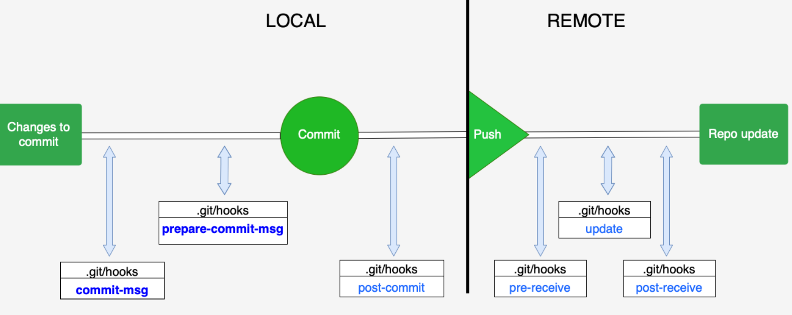

## 1. Конфигурация
В состав Git входит утилита **git config**. Она позволяет просматривать и настраивать параметры, контролирующие все аспекты работы Git и его внешний вид.  
Эти параметры могут быть сохранены в трёх местах:  
* ```/etc/gitconfig```, опция ```--system```  
* ```~/.gitconfig``` или ```~/.config/git/config```, опция ```--global```  
* ```.git/config```, опция ```--local```  
  
Посмотреть все настройки и где они заданы:  
```git config --list --show-origin```

Для корректной работы репозитория, а также для того, чтобы иметь возможность установить автора внесенных изменений, необходимо представиться:  
```$ git config --global user.name "name"```  
```$ git config --global user.email example@email.com```  
  
Чтобы узнать текущие настройки (например, под какими данными мы авторизованы), можно запросить эту информацию у GIT:  
```$ git config --list```  
Данная команда выдаст все конфигурации, установленные для конкретного пользователя.  
Также есть возможность узнать конкретную настройку, например:
```$ git config user.name```
Команда выдаст информацию по запросу.  
  
Также git config позволяет изменить визуальный вывод данных - настройки интерфейса могут облегчить восприятие, например, применить выделение цветом:
```$ git config --global color.ui true```
  
  
## 2. Инициализация GIT-репозитория:  
```$ git init```  
В директории создастся подкаталог **.git**, содержащий базу GIT-репозитория.  

## 3. Загрузка файлов в GIT
Для этого необходимо добавить файлы в индекс и произвести коммит, используя команды ```git add``` и ```git commit```:  
```$ git add .```  
```$ git commit -m 'initial commit'```  
Все  файлы, находящиеся в директории, будут закоммичены. С этого момента проект находится под версионным контролем, поскольку в GIT-репозитории располагаются отслеживаемые файлы и начальный коммит.

## 4. Клонирования существующего репозитория:
Для этого используется команда ```git clone```, к которой добавляется ссылка на существующий репозиторий, а также (при  необходимости) новое имя склонированного репозитория:  
```$ git clone <https://github.com/example/repo>```
В данном случае репозиторий будет называться **repo**  
Также возможно задать другое имя для директории:  
```$ git clone <https://github.com/libgit2/libgit2> newrepo```  
В данном случае репозиторий будет называться **newrepo**  
  
## 5. Файлы в GIT  
Файлы находятся в разном состоянии в зависимости от жизненного цикла:
* untracked — неотслеживаемый 
* unmodified — неизменённый 
* modified — изменённый
* staged — зафиксированный
  
Для того чтобы определить состояние файлов используется команда ```git status```  
В **неизменённом состоянии** файлы находятся сразу после коммита, но до того, как были внесены новые изменения - то есть, когда файлы в рабочей директории соответствуют файлам, попавшим в последний коммит.  
  
Файлы переходят в **изменённое состояние** после того, как в них вносятся любые изменения, но до того, как они будут подготовлены к коммиту. Изменениями является: добавление новых файлов, изменение старых, переименование, удаление - любые действия, воздействующие на содержимое репозитория.  
  
Сообщение **Untracked files** в выводе команды ```git status``` означает, что внесенные изменения ещё не зафиксированы.  
Если какие-то файлы, отмеченные как **Untracked**, нам не нужны, достаточно просто не предпринимать никаких действий в их отношении, чтобы они не попали в следующий коммит.  
Если же мы хотим, чтобы в коммит попали нужные нам изменения, эти изменения необходимо добавить под версионный контроль, то есть, начать отслеживать и, тем самым, подготовить к коммиту.  
**Подготовленным к коммиту** (**staged**) файл становится, если после всех произошедших с ним изменений он индексируется (т.е. вносится во временное хранилище) с помощью команды ```git add```:  
```$ git add README.md```  
  
### 5.1. Вывод статуса  
Один и тот же файл может находиться одновременно в двух разных состояниях (быть одновременно **подготовленным** и **не подготовленным** к коммиту). Это происходит, если изменения в файле были проиндексированы, однако после этого в тот же файл были внесены другие изменения - в таком случае, вывод команды ```git status``` будет выглядеть так:
```
$ git status
On branch master
Changes to be committed:
  (use "git reset HEAD <file>..." to unstage)

    modified:   README.md

Changes not staged for commit:
  (use "git add <file>..." to update what will be committed)
  (use "git checkout -- <file>..." to discard changes in working directory)

    modified:   README.md
```
  
### 5.2. Сокращённый вывод статуса  
Если вы выполните ```git status -s``` или ```git status --short```, вы получите гораздо более упрощённый вывод:
```
$ git status -s ИЛИ git status --short
   M README – модифицирован, не индексирован
MM Namefile – модифицирован, индексирован и ещё раз модифицирован
A  etc/git.txt – добавлен в отслеживаемые 
M  etc/modern.md – модифицирован, индексирован
?? LICENSE.txt – новый неотслеживаемый
```  

### 5.3. Игнорирование  
Для того, чтобы лишние файлы не попадали в staged, необходимо создать файл **.gitignore**, в котором будет перечислено то, что будет отсеиваться автоматически:  
```
$ cat .gitignore
/tmp/
!/tmp/no-cache-data/
/.idea/
/temp/*
*.pyc
*.[oa]
/t?mp/*
*~ 
```  
В этом примере будут игнорироваться файлы, заканчивающиеся на **.о** или на **.а**, а также на **~**.  
Для формирования файла **.gitignore**, необходимо соблюдать следующие правила:  
* Используются стандартные glob-шаблоны - упрощенные регулярные выражения:
  * Символ (*) подразумевает любое количество символов,  
  * Последовательность [abc] - обозначает любой символ из перечисленных в скобках, то есть либо **a**, либо **b**, либо **c**,  
  * Символ (?) подразумевает один символ,  
  * Последовательность [a-z] - обозначает любой символ из указанного в скобках интервала, то есть все от a до z,
* Комментарии в файле **.gitignore** можно ввести, начав строку с символа #,
* (/) слэш в начале и конце строки укажет на конкретный каталог,
* (!) восклицательный знак в начале строки инвертирует шаблон: будут проигнорированы все файлы из указанного каталога, кроме тех, что отмечены восклицательным знаком,
* (/temp/*) - игнорировать все файлы директории temp, но не игнорировать подкаталоги  
  
## 7. Просмотр изменений
Команда ```git diff``` показывает, какие именно строки были удалены/добавлены. Отслеживаться с помощью ```git diff``` могут только те файлы, которые были добавлены под версионный контроль (проиндексированы).  

**Предположим у нас есть:**  
* **README.md**, который был создан и проиндексирован после последнего коммита  
* **EXAMPLE.md**, который был изменён после последнего коммита, но ещё не проиндексирован.  
Для того чтобы проследить судьбу **EXAMPLE.md** и выяснить, какие изменения были внесены, но не были проиндексированы, необходимо вызвать команду ```git diff```, в таком случае её вывод будет таким:  
```
$ git diff
diff --git a/EXAMPLE.md b/EXAMPLE.md
index 643e24f..87f08c8 100644
--- a/EXAMPLE.md
+++ b/EXAMPLE.md
@@ -119,3 +119,4 @@ at the
 ## Starter Projects

 See our [projects list](https://github.com/libgit2/libgit2/blob/development/PROJECTS.md).
+# test line
```  
Где ```diff --git a/EXAMPLE.md b/EXAMPLE.md``` показывает, какие именно файлы сравниваются, где **а** - версия после индексирования, **b** - текущая версия:  
```--- a/EXAMPLE.md``` - дословно читается как "из версии **а** удален файл EXAMPLE.md"  
```+++ b/EXAMPLE.md``` - дословно читается как "в версию **b** добавлен файл EXAMPLE.md"  
Вывод данной команды покажет разницу между содержимым индекса и содержимым рабочего каталога, то есть, от последнего индексирования до текущего момента.  
Команды ```git diff --staged``` и ```git diff --cached``` выполняют одно и то же действие - они показывают разницу между текущим индексом (**подготовленными изменениями**) и **последним коммитом**. Эти две команды могут использоваться взаимозаменяемо, и результат будет идентичным.  
В таком случае вывод этой команды будет выглядеть так:  
```
$ git diff --staged
diff --git a/README.md b/README.md
new file mode 100644
index 0000000..03902a1
--- /dev/null
+++ b/README.md
@@ -0,0 +1 @@
+My Project
```  
Где ```diff --git a/README b/README``` - показывает, какие именно файлы сравниваются, где **а** - версия последнего коммита, **b** - версия последнего индексирования  
```--- /dev/null``` - "удалено отсутствие файла", то есть, в предыдущем коммите данного файла не было  
```+++ b/README.md``` - в версию **b** добавлен файл README.md.
  
В случае, если проиндексированный файл **Example2.md** существовал в последнем коммите, (т.е. ```git status``` называет его не **new file**, а **modified**), вывод команды ```git diff --staged``` будет таким:  
```
$ git diff --staged
diff --git a/Example2.md b/Example2.md
index 8ebb991..643e24f 100644
--- a/Example2.md
+++ b/Example2.md
@@ -65,7 +65,8 @@ branch directly, things can get messy.
 Please include a nice description of your changes when you submit your PR;
 if we have to read the whole diff to figure out why you're contributing
 in the first place, you're less likely to get feedback and have your change
-merged in.
+merged in. Also, split your changes into comprehensive chunks if you patch is
+longer than a dozen lines.

 If you are starting to work on a particular area, feel free to submit a PR
 that highlights your work in progress (and note in the PR title that it's)
```  
Где **diff --git a/Example2.md b/Example2.md** - показывает, что сравниваются файлы **Example2** версии **а** (версии последнего коммита) и версии **b** (версии последнего индексирования).  
```--- a/Example2.md``` - из версии **а** извлечён файл **Example2.md** (т.е. версия этого файла из последнего коммита)  
```+++ b/Example2.md``` - в версию **b** добавлен файл **Example2.md** (т.е. новая версия этого файла, содержащаяся в последнем
индексировании).  
  
Также, если при выводе ```git status``` файл указывается одновременно как **подготовленный** и **не подготовленный** к коммиту, то есть, если файл содержит и **проиндексированные**, и **непроиндексированные** изменения вместе, то возможно просмотреть и те, и другие изменения - для этого необходимо использовать и ```git diff```, и ```git diff --staged``` (```--cached```) в зависимости от того, какие именно изменения нужно просмотреть.  
  
Чтобы выполнить git diff для определенного файла, укажите путь к этому файлу после команды git diff. Например:
```git diff path/to/your/file.txt```  
Это покажет разницу между текущей версией указанного файла в вашей рабочей директории и последним коммитом в репозитории.  
  
Если вы хотите сравнить файл между двумя конкретными коммитами, вы можете использовать следующий формат:
```git diff commit1SHA commit2SHA path/to/your/file.txt```  
  
## 8. Сброс изменений перед коммитом
Если вы случайно добавили файлы с помощью ```git add .``` и хотите отменить эту операцию перед коммитом, вы можете использовать ```git reset``` - это отменит добавление всех файлов, которые вы добавили с помощью ```git add .```. Это снимет все файлы, которые были подготовлены к коммиту.  
  
Если вы хотите отменить добавление конкретного файла, вы можете указать его имя после git reset, например:  
```git reset path/to/your/file.txt```  
После выполнения git reset, файлы будут снова находиться в вашей рабочей директории и не будут подготовлены к коммиту.  
Теперь вы можете пересмотреть изменения и, если необходимо, внести коррективы перед коммитом.  
  
Если вы хотите удалить файл из вашего репозитория и одновременно из индекса (staging area) и больше не хотите видеть его в вашем репозитории, используйте ```git rm <filename>``` 
* ```git rm -f readme``` — удалить файл, если он уже проиндексирован 
* ```git rm --cached readme``` — оставить файл на жёстком диске, но перестать отслеживать. Эта команда также снимет файл с индекса, но она также отметит файл как удаленный, и он будет удален из следующего коммита. Однако файл не будет удален из вашей рабочей директории, и вы по-прежнему сможете видеть и редактировать его локально.
* ```git rm log/\*.log``` — возможность использовать шаблоны


# 9. Коммит  
```$ git commit -m "The awesome commit"```  
Данные, которые не были проиндексированы, не добавляются в коммит и остаются в рабочем каталоге.  
  
Если вы хотите включить новые изменения в уже созданный коммит, вы можете воспользоваться командой ```git commit --amend```. Вот как это сделать:  
1. Добавьте новые изменения в файлы. Затем выполните команду git add, чтобы подготовить эти изменения к коммиту:  
```git add файлы-с-новыми-изменениями```  
2. Теперь, чтобы включить новые изменения в последний коммит, выполните команду:  
```git commit --amend```  
Это откроет текстовый редактор, где вы можете отредактировать сообщение коммита, если это необходимо. Сохраните изменения и закройте редактор.  
Если вы хотите изменить коммит сразу в командной строке без открытия редактора, вы можете использовать флаг -m для git commit --amend и передать сообщение коммита в кавычках. Вот пример: ```git commit --amend -m "Ваше новое сообщение коммита"```  
3. В результате коммит будет изменен, и в него будут включены новые изменения, а также, при желании, измененное сообщение коммита.  
Обратите внимание, что изменение коммита с помощью ```git commit --amend``` изменяет историю коммитов. Будьте осторожны при использовании этой команды, особенно если вы уже поделились своими изменениями с другими. Т.е. изменение истории коммитов с помощью git commit --amend влияет на предыдущие коммиты и создает новый коммит, который заменяет предыдущий. Это означает, что если вы изменили коммит и затем отправили его в удаленный репозиторий, другие участники, работающие с этим репозиторием, могут столкнуться с проблемами. Когда история коммитов изменяется, это означает, что SHA-хеши (уникальные идентификаторы коммитов) всех последующих коммитов также изменяются. Это может сбить с толку других участников, которые ранее скачали измененный коммит. При попытке синхронизировать свой репозиторий с удаленным репозиторием они могут столкнуться с конфликтами или проблемами с обновлением.  
  
Коммит включает в себя: сам объект коммита, объект дерева файлов, blob'ы самих файлов. Каждый файл, каждый объект имеют свой хеш. Эти хеши записываются в определённые последовательности. И таким образом, GIT сверяя контрольные суммы убеждается, что всё с этим деревом в порядке.  
  
**HEAD** - указатель, который указывает на то, где находится наш текущий каталог - в какой ветке и на каком коммите.
      
## 10. История коммитов  
Основная команда для просмотра истории: ```git log```  
У команды ```git log``` есть очень большое количество опций для поиска коммитов по разным критериям.  
Команда ```git log -2``` выведет последние 2 коммита.  
  
**Полезные аргументы:**  
* ```--patch``` показывает разницу (выводит патч), внесённую в каждый коммит:  
```$ git log --patch -1``` (или ```git log -p -1```)  
* ```$ git log --stat -2``` отображает аналогичную информацию, но содержит разницу для каждой записи. Опция печатает под каждым из коммитов список и количество изменённых файлов, а также количество строк, которое было добавлено и удалено в каждом из файлов. В конце можно увидеть суммарную таблицу изменений  
* ```$ git log --pretty=oneline``` (или ```short```, ```full```, ```fuller```) опция --pretty меняет формат вывода  
* ```$ git log --pretty=format:"%h - %an, %ar : %s"``` опция --format позволяет указать формат для вывода данных. Опции форматирования:  
  * ```%H``` — хеш коммита
  * ```%h``` — сокращённый хеш коммита
  * ```%T``` — хеш дерева
  * ```%t``` — сокращённый хеш дерева
  * ```%P``` — хеш родителей
  * ```%p``` — сокращённый хеш родителей
  * ```%an``` — имя автора
  * ```%ae``` — электронная почта автора
  * ```%ad``` — дата автора (формат даты можно задать опцией --date=option)
  * ```%ar``` — относительная дата автора
  * ```%cn``` — имя коммитера
  * ```%ce``` — электронная почта коммитера
  * ```%cd``` — дата коммитера
  * ```%cr``` — относительная дата коммитера
  * ```%s``` — описание коммита  
* ```$ git log --shortstat``` — отображает только строку с количеством изменений/вставок/удалений для команды --stat
* ```$ git log --name-only``` — показывает список изменённых файлов после информации о коммите
* ```$ git log --name-status``` — показывает список файлов, которые добавлены/изменены/удалены
* ```$ git log --abbrev-commit``` — показывает только несколько символов чек-суммы SHA-1 вместо всех 40
* ```$ git log --relative-date``` — отображает дату в относительном формате
* ```$ git log --graph``` — отображает графы с ветвлениями
* ```$ git log --pretty``` — альтернативный формат: oneline, short, full, fuller и format (с помощью последней можно указать свой формат)
* ```$ git log --oneline``` — сокращение для одновременного использования опций --pretty=oneline --abbrev-commit  
  
**Ограничения git log:**  
* ```-(n)``` — показывает только последние n коммитов
* ```--since```, ```--after``` — показывает только те коммиты, которые были сделаны после указанной даты (например, "2007-11-11"), или же относительную дату, например "4 years 2 day 32 minutes ago"
* ```--until```, ```--before``` — показывает только те коммиты, которые были сделаны до указанной даты
* ```--committer``` — показывает только те коммиты, в которых запись committer совпадает с указанной строкой  
  
**Посмотреть данные коммита, зная его хеш:**  
```$ git show <hash_commit>``` 
  

## 11. Операции отмены
Внимание! Операции отмены — одна из редких областей GIT, где неверными действиями можно необратимо удалить результаты своей работы.  
  
### 11.1. Изменение последнего коммита  
В результате выполнения команд получится единый коммит  —  второй коммит заменит результаты первого:  
```$ git commit -m 'initial commit'```  
```$ git add forgotten_file```  
```$ git commit --amend```  
Мы можем попробовать найти старый коммит при помощи ```git show``` и ```git log```, так как на самом деле старый коммит также остался в истории.  
```git reflog``` - позволяет посмотреть коммиты, которые были сделаны локально на компьютере. Команда запоминает все ссылки, которые использовались в нашей рабочей копии.
  
Чтобы удалить из staged какой-то файл, можно воспользоваться командой: ```git restore HEAD <filename>``` либо ```git restore --staged <filename>```  
  
### 11.2. Отмена изменинй в файле  
Если решили, что не хотите сохранять свои изменения файла, то можно отменить изменения - таким образом они будут не записаны в staging area, но останутся в файле:  
```
$ git status
…
Changes not staged for commit:
  (use "git add <file>..." to update what will be committed)
  (use "git checkout -- <file>..." to discard changes in working directory)
    modified:   README.md
```  
  
```
$ git checkout -- README.md 
$ git status
On branch master
Changes to be committed:
  (use "git reset HEAD <file>..." to unstage)
    renamed:    README.md -> README
```
  
Команда ```git restore <filename>``` или ```git checkout -- <filename>``` - не только уберёт файл из staging area, но также удалит и изменения из самого файла.  
**Внимание!** Важно понимать, что ```git checkout -- <file>``` — опасная команда. Все локальные изменения в файле пропадут: GIT просто заменит его версией из последнего коммита.  
  
  
### 11.3. Удалить коммит  
* **В локальном репозиторие перед коммитом**:  
Если вы хотите удалить последний коммит, который ещё не был отправлен в удалённый репозиторий, вы можете использовать команду:  
```git reset HEAD~1```  
Эта команда сбросит HEAD на один коммит назад (**HEAD** в GIT - это указатель на последний коммит в текущей ветке. Когда вы выполняете команду git reset HEAD~1, вы фактически перемещаете указатель "HEAD" на один коммит назад, тем самым отменяя последний коммит в текущей ветке. "HEAD" указывает на текущую позицию, на которой вы находитесь в вашем репозитории. Когда вы делаете коммит, "HEAD" перемещается на новый коммит), что фактически уберет последний коммит из вашей локальной ветки. Ваши изменения останутся в рабочей директории как неотслеживаемые изменения.  
  
Если вы также хотите удалить изменения из рабочей директории, добавьте к команде флаг --hard:  
```git reset --hard HEAD~1```  
Внимание! Команда git reset --hard удалит все неотслеживаемые изменения в рабочей директории. Убедитесь, что вы не удаляете важные изменения.  
  
* **В удалённом репозиторие после коммита**:  
Внимание! Удаление коммита из удаленного репозитория может быть сложной задачей, особенно если другие участники уже скачали этот коммит и внесли изменения. Изменение истории коммитов в общем репозитории может привести к проблемам синхронизации и конфликтам.  
  
Однако, если вы уверены, что удаление коммита не вызовет серьезных проблем для других участников и вы обладаете достаточными правами доступа к удаленному репозиторию, вы можете использовать команду git push с опцией --force (или -f), чтобы принудительно отправить измененную историю коммитов на удаленный сервер. Вот как это делается:  
Вы можете использовать команду git push с опцией --force. Однако, это не фактическое удаление коммита, а его замещение новым коммитом. Другие участники репозитория должны будут внести изменения согласованно с новой историей коммитов.  
Если вы абсолютно уверены, что хотите удалить коммит из удаленного репозитория, вы можете выполнить следующие шаги:  
1. В локальном репозитории используйте команду ```git reset``` для отката локальной ветки к нужному коммиту (технически это не удалит коммит, но переместит указатель ветки): ```git reset коммит-который-нужно-удалить```  
2. Затем используйте ```git push``` с опцией ```--force```, чтобы принудительно отправить измененную историю коммитов на удаленный сервер: ```git push origin ваша-ветка --force```  
  

## 12. Удалённые репозитории  
  
### 12.1. Просмотр удалённых репозиториев  
Посмотреть их список: ```git remote```  
После клонирования как минимум один **origin**  —  имя по умолчанию. Его GIT даёт серверу, с которого производилось клонирование.
Ключ ```-v``` для более подробного вывода:  
```
$ git remote -v
origin  git@github.com:akatkinia/IT_tips.git (fetch)
origin  git@github.com:akatkinia/IT_tips.git (push)
```  
Где fetch это репозиторий для получения данных, а push для отправки данных

### 12.2. Добавление удалённых репозиториев  
Чтобы добавить удалённый репозиторий и присвоить ему имя (shortname), просто выполните команду ```git remote add <shortname> <url>```:  ```$ git remote add <repository_shortname> https://github.com/<user>/<repository>```  
Таким образом у нас будет подключен ещё один удалённый репозиторий к нашему локальному репозиторию, который состоит из 2 записей fetch и push.  
  
### 12.3. Fetch  
Команда **git fetch** связывается с указанным удалённым проектом и забирает все те данные проекта, которых у вас ещё нет.  
После выполнения этой команды у вас появятся ссылки на все ветки из этого удалённого проекта, которые вы можете просмотреть или слить в любой момент.
Чтобы получить изменение из какого-то конкретного репозитория, необходимо воспользоваться командой **fetch**:  
```git fetch <repository_shortname>```  
Таким образом GIT получит все изменения, все ветки из удалённого репозитория <repository_shortname>    
Для того чтобы получить изменения из всех удалённых веток: ```git fetch --all```
**Важно!**  
```git fetch``` забирает данные в ваш локальный репозиторий, но не сливает их с какими-либо вашими наработками и не модифицирует то, над чем вы работаете в данный момент. Вам необходимо вручную слить эти данные с вашими, когда вы будете готовы.  
Команда ```git fetch``` извлекает изменения (коммиты, ветки, теги и так далее) из удаленного репозитория, но не интегрирует их в вашу текущую ветку.  
Это позволяет вам просмотреть изменения, которые были внесены в удаленный репозиторий, без автоматической интеграции в вашу локальную ветку.  
После выполнения ```git fetch```, вы можете решить, какие изменения вы хотите интегрировать с вашей веткой с помощью ```git merge``` или ```git rebase```.


### 12.4. Pull
Команда **git pull** извлекает (fetch) данные с сервера, с которого вы изначально клонировали, и автоматически пытается слить (**merge**) их с кодом, над которым вы в данный момент работаете.  
  
Команда ```git pull``` выполняет две операции:  
* Сначала она выполняет ```git fetch```, чтобы получить изменения из удаленного репозитория
* Затем пытается автоматически объединить (```merge```) эти изменения с текущей веткой  
Это удобно в том случае, когда вы хотите получить и интегрировать изменения из удаленного репозитория в вашу текущую ветку одной командой.
Однако это также может привести к конфликтам слияния (**merge conflicts**), если есть изменения в вашей ветке, которые конфликтуют с изменениями из удаленного репозитория.  
  
### 12.5. Push  
Команда ```git push``` отправит изменения в удалённый репозиторий.
  
### 12.6. Отправка изменений  
Если вы хотите поделиться своими наработками, вам необходимо отправить их в удалённый репозиторий. Команда для этого действия простая: ```git push <remote-name> <branch-name>```  
  
### 12.7. Просмотр удалённого репозитория  
```$ git remote show origin```  
Команда используется для отображения информации об удаленном репозитории с именем "origin". Команда покажет следующую информацию:
* URL удаленного репозитория
* Признаки (Fetch и Push): Команды git fetch и git push могут работать независимо для удаленного репозитория. Вывод команды покажет, какие из них настроены для удаленного репозитория "origin".
* Головные ветки и их отслеживание: какие головные ветки находятся в удаленном репозитории "origin" и какие из них отслеживаются в вашем локальном репозитории.
* Ветки, которые не отслеживаются: ветки, которые есть в удаленном репозитории, но которые не отслеживаются в вашем локальном репозитории.
* Ветки, которые можно отправить в удаленный репозиторий: информация о том, какие из ваших локальных веток можно отправить в удаленный репозиторий "origin".
* Различные настройки и опции, связанные с удаленным репозиторием, такие как прокси и другие настройки.
  
### 12.8. Переключение ветки  
Вы можете использовать команду **git checkout** для переключения между существующими ветками в вашем репозитории. Например, для переключения на ветку с именем "my-branch", выполните следующую команду: ```git checkout my-branch```  
  
### 12.9. Создание новых веток  
Вы также можете создать новую ветку и перейти на нее с помощью **git checkout**. Например: ```git checkout -b new-branch```  
  
Для того чтобы на основе одной ветки создать другую:  
```git checkout feature/testbranch -b new-branch```  
После выполнения этой команды у вас будет новая ветка с именем new-branch, которая будет точной копией ветки feature/testbranch, и она будет текущей веткой в вашем репозитории.  
  
После создания новой ветки локально, затем можно отправить ее в удаленный репозиторий: ```git push origin <new-branch-name>```  
**Но:** эта команда используется для отправки локальной ветки в удаленный репозиторий без установки upstream (отслеживания), что означает, что GIT не будет автоматически отслеживать изменения в этой ветке между вашим локальным и удаленным репозиториями. Для того чтобы назначить upstream для ветки, см следующий пункт.

### 12.10. Запушить новую локальную ветку в удалённый репозиторий
```git push --set-upstream origin <new-branch-name>``` или ```git push -u origin new_branch_name```  
Команды позволяет отправить новую локальную ветку в удаленный репозиторий и одновременно установить upstream для этой ветки.  
Ветка будет создана на удаленном репозитории с тем же именем, что и локальная ветка, и она будет связана в качестве upstream.  
Если же требуется создать удалённую ветку с другим наименованием, можно воспользоваться командой ```git push remote_repository new_branch_name:new_remote_branch_name```  
  
## 12.11. Удаление ветки  
**Удаление ветки (безопасное удаление):**  
```git branch -d branch_name```  
GIT попытается удалить ветку, но если ветка не была слита в текущую ветку (то есть все изменения в этой ветке еще не включены в текущую ветку), GIT не позволит вам удалить ее, чтобы предотвратить потерю данных.  
  
**Принудительное удаление ветки (осторожно):**
```git branch -D branch_name```
Эта команда (-D означает force delete) удалит ветку независимо от того, была ли она слита в текущую ветку или нет. Будьте осторожны при использовании этой команды, так как она может потерять данные, если вы случайно удалите ветку с незакоммиченными изменениями.
  
**Удаление удалённой ветки:**  
Чтобы удалить удаленную ветку в Git, вы можете использовать команду git push с флагом --delete. Вот синтаксис:  
```git push <remote_name> --delete <branch_name>```
  
  
### 12.12. Переключение на конкретный коммит  
Вы также можете использовать **git checkout** для переключения на определенный коммит. Например: ```git checkout <код_коммита (SHA-1 хэш)>```  
Это переключит ваш репозиторий на указанный коммит и создаст "detached HEAD", что означает, что изменения не будут привязаны к какой-либо ветке.  
Это полезно если вы хотите переместиться к конкретной точке в истории вашего репозитория, но не привязываете этот коммит к какой-либо ветке. Вместо этого ваш HEAD указывает непосредственно на выбранный коммит.  
Вот как это работает:  
1. Вы выполняете команду ```git checkout <код_коммита>```, где <код_коммита> - это идентификатор (SHA-1 хэш) конкретного коммита, к которому вы хотите переключиться.
2. GIT перемещает ваш HEAD (и текущую ветку, если она была) так, чтобы они указывали на выбранный коммит. Это означает, что вы находитесь в "detached HEAD" состоянии, потому что HEAD указывает непосредственно на коммит, а не на ветку.
3. Вы можете просматривать файлы и историю в этом состоянии, как обычно. Однако, если вы внесете изменения и сделаете коммит, создастся новый коммит, но ветки не будут обновлены, и ваш новый коммит не будет связан с какой-либо веткой.  
  
Это полезно, например, для просмотра и тестирования конкретных коммитов в изоляции, но вы должны быть осторожны, так как ваши изменения могут быть потеряны, если вы переключитесь на другую ветку или закроете "detached HEAD".  
Чтобы избежать потери изменений, вы можете создать новую временную ветку из "detached HEAD" состояния, чтобы сохранить ваши изменения и работать с ними дальше.  

### 12.13. Переименование удалённого репозитория (в конфигурации локального репозитория)  
Для переименования удалённого репозитория можно выполнить команду git remote rename: ```$ git remote rename origin awesome```  
После выполнения этой команды имя удаленного репозитория будет изменено с origin на awesome в вашем локальном репозитории.  
  
### 12.14. Удаление удаленного репозитория (в конфигурации локального репозитория)
```$ git remote rm origin```  
После выполнения этой команды, удаленный репозиторий "origin" будет удален из вашего локального репозитория. Обратите внимание, что это не удалит сам удаленный репозиторий на удаленном сервере. Он просто будет удален из вашей конфигурации локального репозитория.  
Это означает, что Git больше не будет знать о существовании удаленного репозитория с именем "origin" в вашем локальном репозитории. Удаленный репозиторий "origin" больше не будет связан с вашим локальным репозиторием.  
Если вам нужно заново добавить удаленный репозиторий "origin" или другой удаленный репозиторий с другим именем, вы можете использовать команду git remote add. Например: ```git remote add new_origin <URL-удаленного-репозитория>```


### 12.15. Переименование ветки  
  
  

## 13. Теги  
Теги в GIT используются для фиксации определенных точек в истории вашего репозитория. Основное назначение тегов заключается в том, чтобы помечать конкретные коммиты как важные моменты в истории проекта, например для пометки релизов. Т.е., вы можете создать тег, который указывает на коммит, соответствующий конкретной версии. Это помогает легко находить и отслеживать релизы.  
  
Также это добавляет легкость восстановления предыдущих состояний - используя теги, вы можете легко переключаться между разными версиями вашего проекта. Это полезно, когда вам нужно быстро вернуться к определенной стабильной версии для устранения проблем или проведения сравнения с текущим состоянием.  
  
Теги упрощают сравнение различных версий проекта. Вы можете легко сравнивать изменения между двумя тегами, чтобы понять, какие изменения были внесены между версиями.  
  
Теги фиксируют коммиты на определенной точке истории. Они предотвращают случайное изменение этих коммитов, так как теги обычно нельзя изменить без применения принудительных действий.  
  
Теги в GIT можно создавать как легковесные (lightweight), которые указывают на определенный коммит, или аннотированные (annotated) теги, которые также содержат метаданные и сообщение о теге. Аннотированные теги часто предпочтительнее, когда требуется более подробная информация о метке.  
  
### 13.1. Просмотр тегов  
Просмотреть список имеющихся тегов можно командой ```git tag``` (параметры ```-l``` и ```--list``` опциональны):
```
$ git tag -l 'v1.1.2*'
v1.1.2
v1.1.2-rc0
v1.1.2-rc1
v1.1.2-rc2
v1.1.2.1
```

### 13.2. Аннотированные теги  
Для создания аннотированной метки в GIT используется команда ```tag``` с ключом ```-a```:  
```
$ git tag -a v0.0 -m 'init version'
$ git tag
v0.0
```  
  
```
$ git show v0.0
tag v0.0
Tagger: <tagger>
Date: <date>
```  
Этот тег будет привязан к текущему коммиту, на котором вы находитесь в данный момент. То есть, если вы выполнили эту команду, находясь на определенном коммите, то тег будет связан с этим коммитом.


### 13.3. Легковесные теги  
Для создания аннотированной метки в GIT используется команда ```tag``` без дополнительных ключей:  
```
$ git tag v0.1
$ git tag
v0.0
v0.1
```  
Этот тег будет привязан к текущему коммиту, на котором вы находитесь в данный момент. То есть, если вы выполнили эту команду, находясь на определенном коммите, то тег будет связан с этим коммитом.  
  
### 13.4. Тегирование предыдущих коммитов  
Для добавления тега к старому коммиту, выполните следующие шаги:  
* Определите хеш (SHA-1) коммита, к которому вы хотите добавить тег. Вы можете найти хеш коммита, выполнив команду ```git log```, чтобы просмотреть историю коммитов и скопировать хеш нужного коммита.
* Используйте команду git tag, указав имя тега и хеш коммита:
```git tag -a <tag_name> <commit_hash> -m '<comment>'```  
  
Добавление тега к старому коммиту не изменяет сам коммит или его историю. Это просто добавляет метку, которая облегчит ссылку на этот коммит в будущем.  
  
### 13.5. Обмен тегами
После создания, теги нужно отправлять в удалённый сервер.
* ```git push origin <tagname>``` - отправить конкретный тег в удалённый репозиторий 
* ```git push origin --tags``` - отправить все теги из локального репозитория в удалённый  
  
### 13.6. Удаление тегов  
* Для удаления тега из локального репозитория вы можете использовать команду ```git tag``` с ключом ```-d``` или ```--delete``` за которым следует имя тега. Пример:
```
$ git tag -d v0.0
Deleted tag 'v0.0' (was 287119d)
```  
После выполнения этой команды, тег будет удален из вашего локального репозитория.  
Обратите внимание, что удаление тега не удаляет соответствующий коммит или изменяет историю репозитория. Это просто удаляет локальный указатель на тег. 
  
* Для удаления тега на удаленном репозитории, вам также нужно будет выполнить команду ```git push``` с ключом ```--d``` за которым следует имя удаленного репозитория и имя тега. Например:
```git push origin --d my_tag```
В этом случае тег будет удалён только с удаленного репозитория.  
  
### 13.7. Переход на тег  
Если вы хотите получить версии файлов, на которые указывает тег, то вы можете сделать ```git checkout <tag_name>``` для тега. Однако это переведёт репозиторий в состояние **detached HEAD**, которое имеет ряд неприятных побочных эффектов:
Когда вы используете git checkout для переключения на тег, репозиторий переходит в состояние "detached HEAD". Это состояние имеет некоторые потенциальные неприятные побочные эффекты:
* **Изменения не сохраняются**: В состоянии "detached HEAD" вы не можете делать новые коммиты напрямую. Это означает, что любые внесенные изменения в файлы не будут сохранены в виде нового коммита, и вы потеряете их, если переключитесь на другую ветку или тег.
* **Потеря текущей ветки**: Когда вы переключаетесь на тег, текущая ветка (HEAD) фактически теряет связь с веткой или коммитом, и вы находитесь в неконтролируемом состоянии.
* **Создание коммитов**: Хотя вы не можете создавать новые коммиты напрямую в "detached HEAD", вы всегда можете создать новую ветку на этом состоянии и продолжить работу с новой веткой. В этом случае, оставшееся состояние "detached HEAD" останется как есть, и ветка будет создана на основе этого коммита.
* **Смещение HEAD**: Если вы случайно сместите HEAD, например, переключившись на другой коммит, все изменения в текущем "detached HEAD" состоянии могут быть утеряны.  
  
Исходя из этих побочных эффектов, при работе с тегами или конкретными коммитами, рекомендуется создавать новую ветку на этом коммите, чтобы избежать "detached HEAD" и сохранить свои изменения в виде нового коммита.  

### 13.8. Создание ветки от тега
Для создания новой ветки от этого тега: перейти к тегу командой ```git checkout <tag>```, выполнить ```git switch -c <new-branch-name>``` или ```git checkout -b <new-branch-name>```  
Или же можем не переключаясь на тег, создать от конкретного тега ветку: ```git switch -c <new-branch-name> <tag_name>```  
  
  
## 14. Алиасы  
Если вы не хотите печатать каждую команду для GIT целиком, вы можете настроить alias'ы для любой команды с помощью **git config**. Например:  
```
$ git config --global alias.co checkout
$ git config --global alias.br branch
$ git config --global alias.pl pull
$ git config --global alias.ps push
$ git config --global alias.st status
$ git config --global alias.ci commit
$ git config --global alias.last 'log -1 HEAD'
```  
  
## 15. Ветвления
Когда мы добавляем файлы в коммит, для каждого файла вычисляется контрольная сумма. То есть для каждого файла создаются blob'ы - объекты, в которых содержится содержимое файлов. Таким образом GIT у себя внутри хранит файл и его контрольную сумму.

### 15.1. Визуализация  
Разветвлённую историю можно визуализировать с помощью команды ```git log```.  
Для отображения истории коммитов, текущего положения указателей веток и истории ветвления выполните команду ```git log --oneline --decorate --graph --all``` (но можно и без --decorate, по умолчанию он включён и так)  
  
### 15.2. Слияние веток (merge)  
Предположим мы хотим выполнить merge (влить) некой решённой задачи в master.  
Для этого нужно выполнить слияние ветки hotfix. Для этого нужно  переключиться на ветку, в которую вы хотите включить изменения, и выполнить команду ```git merge```:  
```
$ git checkout master
$ git merge hotfix
```  
После чего можно удалить ветку issue1: ```git branch -d hotfix```  
Т.е. необходимо перейти в ту ветку, в которую мы хотим сливать другую ветку и выполнить слияние:
  
### 15.3. Конфликты  
Пример образования конфликта при попытке слияния:  
```
$ git merge issue1
Auto-merging index.html
CONFLICT (content): Merge conflict in index.html
Automatic merge failed; fix conflicts and then commit the result.
```
```
$ git status
On branch master
You have unmerged paths.
  (fix conflicts and run "git commit")
Unmerged paths:
  (use "git add <file>..." to mark resolution)
    both modified:      index.html
no changes added to commit (use "git add" and/or "git commit -a")
```  
  
### 15.4. Разрешение конфликта  
В файле увидим следующую информацию, которая показывает состояние из текущей ветки, где установлен указатель, а также то, что указано в ветке issue1:  
```
$ vim index.html
<<<<<<< HEAD:index.html
<div id="footer">contact : email.support@example.com</div> 
=======
<div id="footer">
 please contact us at support@example.com
</div>
>>>>>>> issue1:index.html
```  
  
Необходимо оставить только то что нужно. Например:  
```
<div id="footer">
 please contact us at support@example.com
</div>
```  
После чего необходимо добавить файлы в staging area и выполнить commit.  
  
### 15.5. Перебазирование (rebase)  
В случаях когда мы хотим, чтобы наша история коммитов была более гладкой и линейной, вместо merge (когда создаются merge commit и история станвится разветвлённой), можно воспользоваться rebase.  

С помощью команды ```rebase``` вы можете взять все коммиты из одной ветки и в том же порядке применить их к другой ветке.  
В данном примере мы переключимся на ветку **test** и перебазируем её относительно ветки **master** следующим образом:  
```
$ git checkout test
$ git rebase master
```  
Т.е. эта команда значит изменить базу ветки test на последний коммит ветки master.  
Теперь можно переключиться на ветку master и сделать слияние с веткой test (слияние перемоткой (fast-forward)):  
```
$ git checkout master
$ git merge test
```
И таким образом будет выполнен merge методом fast-forward, что гарантирует отсутствие конфликтов при слиянии.  
  
**Основные причины использования rebase:**  
* Нет merge-коммитов  
* Более чистая история за счёт её линейности  
* Во время ребейза можно сделать ещё разные интересные преобразования  
  
#### 15.5.1. Rebase через промежуточную метку
Предположим, что в какой-то момент мы ответвились от master в ветку server, а затем снова ответвились, но уже не от master, а от client.  
Т.е. нам нужно чтобы при перебазировании, воспроизведение коммитов, применялось к другой ветке - применить в master только изменения с client, не забирая с собой изменений из ветки server.  
Сделать это на ветке master можно при помощи ```git rebase --onto```:  ```$ git rebase --onto master server client```  
Команда означает: переключиться на ветку **client**, найти изменения относительно ветки **server** и применить их для ветки **master**.  
После этого, когда мы перенесли коммиты и получили более простую историю, мы можем переключиться на ветку **master** и смержить **ветку client**:  
```
$ git checkout master
$ git merge client
```  
  
**Преобразование ветки server**  
Теперь мы можем аналогично описанному в прошлом пункте **заребейзить** ветку server.  
Мы можем выполнить перебазирование ветки **server** относительно ветки **master** без предварительного переключения на неё (в ветку **server**) при помощи команды:
```
$ git rebase <basebranch> <topicbranch>
```  
Т.е.:  
```
$ git rebase master server
```  

После этого мы можем выполнить перемотку основной ветки (master).  
Для этого мы переключаемся на ветку master, выполняем merge с веткой server и удаляем ветки client и server:  
```
$ git checkout master
$ git merge server
$ git branch -d client $ git branch -d server
```  

#### 15.5.2. Опасности rebase  
* Rebase не переносит коммиты, а создаёт новые аналогичные. Т.е. меняется контекст коммитов (их порядок, их связи друг с другом и, возможно, содержание), и в результате rebase существует вероятность того, что может измениться смысл нашего кода.  
* Не ребейзить ветку master.
* Не перемещайте коммиты уже отправленные в удалённый репозиторий в общую ветку (можно ребейзить свою ветку, но не ту, где может работать кто-то ещё. Либо перед этим уведомить).  
  
### 15.6. Merge vs Rebase? (слияние или преобразование)  
* В отличие от слияния (merge), rebase изменяет историю коммитов.  
* С помощью ребейза можно достичь более упорядоченной и линейной истории.  
* Перебазирование (rebase) ветки, которая еще не была использована другими пользователями, может быть правильным выбором, когда необходимо убрать ненужные изменения (мусор) в вашем репозитории.  
  
  
## 16. Пользовательские скрипты (хуки)  
Это серверные скрипты запускающиеся при определённых событиях  
  
* Git хранит свои хуки в папке **.git/hooks** внутри репозитория
* Когда вы создаете новый репозиторий с помощью ```git init```, Git также создает примеры хуков
* Если вы хотите использовать стандартные хуки, просто удалите постфикс "sample" в их именах
* Вы можете создать собственные хуки, разместив их скрипты в этой папке
* Важно, чтобы скрипты хуков были помечены как исполняемые (executable), чтобы Git мог их выполнить автоматически при соответствующих событиях  
  
### 16.1. Виды хуков  
* Клиентские хуки
  * **Нет гарантии выполнения:** Клиентские хуки - это скрипты, выполняемые на стороне клиента Git, и они могут быть легко отключены пользователем (имеются специальные флаги чтобы их не выполнять). Нет гарантии того, что клиент выполнит или даже активирует клиентские хуки.
  * **Не копируются при клонировании репозитория:** Клиентские хуки хранятся локально на стороне клиента и не копируются при клонировании репозитория. Это означает, что другие пользователи, клонирующие репозиторий, не получат эти хуки.
* Серверные хуки
  * **Гарантия выполнения:** Серверные хуки - это скрипты, выполняемые на стороне сервера Git. Они выполняются автоматически при определенных событиях (например, при попытке push). Это предоставляет более надежную гарантию выполнения, так как сервер контролирует их выполнение.
  * **Копируются при клонировании репозитория:** Серверные хуки обычно хранятся в репозитории Git на стороне сервера и могут быть скопированы другими пользователями, клонирующими репозиторий. Это гарантирует, что правила и проверки, определенные серверными хуками, применяются ко всем пользователям, работающим с репозиторием.  
  
  
  
### 16.2. Клиентские хуки
* **Нет гарантии выполнения:** Клиентские хуки - это скрипты, выполняемые на стороне клиента Git, и они могут быть легко отключены пользователем (имеются специальные флаги чтобы их не выполнять). Нет гарантии того, что клиент выполнит или даже активирует клиентские хуки.
* **Не копируются при клонировании репозитория:** Клиентские хуки хранятся локально на стороне клиента и не копируются при клонировании репозитория. Это означает, что другие пользователи, клонирующие репозиторий, не получат эти хуки.

#### 16.2.1. Хуки уровня коммита  
* pre-commit
  * Запускается до запроса сообщения коммита
  * Можно выполнить простую проверку кода:
    * Простые тесты
    * Стиль кода
    * И т.д.
  * Игнорируется флагом ```--no-verify``` (например, ```git commit --no-verify```)
* prepare-commit-msg 
* commit-msg
  
**Примеры стандартных хуков, которые находятся в директории .git/hooks:**  
* pre-commit
  * **Запускается до запроса сообщения коммита:** Pre-commit хук выполняется автоматически перед тем, как Git запросит сообщение коммита. Это предоставляет возможность проверить или модифицировать изменения перед фиксацией.
  * **Можно выполнить простую проверку кода:** Pre-commit хук часто используется для проведения простых проверок кода, таких как:
    * Простые тесты
    * Проверка стиля кода
    * И другие подобные операции.
  * **Игнорируется флагом** ```--no-verify```**:** Если при коммите использовать флаг ```--no-verify```, pre-commit хук будет игнорирован. Это может быть полезно, если вам необходимо сделать коммит, не запуская pre-commit проверки (например, ```git commit --no-verify```).
* prepare-commit-msg
  * **Запускается после выбора сообщения коммита, но перед его редактированием:** Prepare-commit-msg хук выполняется после того, как было выбрано сообщение коммита, но перед тем, как оно будет предоставлено для редактирования. Это предоставляет возможность автоматически добавить информацию в сообщение коммита, например, номер задачи или автоматически сгенерированные данные.
  * **Может быть использован для автоматизации процесса:** Часто этот хук используется для автоматизации процесса внесения данных в сообщение коммита, чтобы сделать его более информативным или соответствующим определенным требованиям.
  * **Позволяет изменять стандартные сообщения коммитов**
* commit-msg
  * **Принимает на вход путь к временному файлу с сообщением к коммиту**
  * **Позволяет проверить сообщение коммита на основании шаблонов**
  * **Запускается после того, как сообщение коммита было введено, но перед фактическим коммитом:** Commit-msg хук выполняется после того, что сообщение коммита было введено пользователем, но перед фактическим завершением коммита. Это предоставляет возможность проверить или модифицировать сообщение коммита перед его сохранением.
  * **Часто используется для применения стандартов сообщений:** Commit-msg хук часто используется для проверки того, что сообщение коммита соответствует стандартам проекта, таким как форматирование, наличие номера задачи или другие требования к сообщениям коммита.  
  
#### 16.2.2. Email хуки  
* Вызываются командой ```git am``` (команда принимает патчи, которые было принято передавать по email)
* Патчи создаются командой ```git format-patch```
  
**Доступные email хуки:**  
* applypatch-msg
  * **Запускается перед командой git am:** Applypatch-msg хук выполняется перед тем, как команда ```git am``` применит изменения из патча. Он позволяет вам проверить и, если необходимо, модифицировать сообщение коммита, связанное с патчем, до его применения.
  * **Может быть использован для автоматической обработки сообщений:** Этот хук может быть использован для автоматической обработки сообщений коммита, связанных с применением патчей, чтобы сделать их более информативными или соответствующими стандартам проекта.
* pre-applypatch хук
  * **Запускается перед командой git am:** Pre-applypatch хук также выполняется перед командой ```git am```, но он дает вам возможность проверить или модифицировать изменения из патча до их фактического применения.
  * **Полезен для проверки изменений перед коммитом:** Этот хук может быть полезен для проверки изменений, прежде чем они будут зафиксированы в коммите, что позволяет избежать ошибок и нежелательных изменений.
* post-applypatch хук
  * **Запускается после команды git am:** Post-applypatch хук выполняется после успешного применения патча с помощью команды ```git am```. Он предоставляет возможность выполнить дополнительные действия или уведомления после успешного применения изменений.
  * **Может использоваться для внесения изменений в инфраструктуру проекта:** Этот хук может быть использован для внесения изменений в инфраструктуру проекта или для уведомлений о завершении применения патча.  
  
**Патчи (patches)** - это текстовые файлы, которые содержат информацию об изменениях в исходном коде или файле. Патчи представляют собой набор инструкций, которые описывают, как изменить одну версию файла, чтобы получить другую версию. Они часто используются для применения изменений, созданных в одном контексте или на одной версии программы, к другим версиям или экземплярам программы.  
Патчи могут быть созданы вручную или с помощью специальных инструментов, таких как ```diff``` или ```git diff```, которые сравнивают две версии файла и создают файл, который описывает различия между ними. Патчи могут включать информацию о добавлении, удалении, изменении строк кода и других изменениях в файле.

#### 16.2.3. Другие клиентские хуки  
* pre-rebase
  * **Запускается перед операцией git rebase:** Pre-rebase хук выполняется перед выполнением операции git rebase, которая используется для пересоздания коммитов в истории репозитория. Этот хук может быть использован для выполнения дополнительных проверок перед перебазированием, изменениям в сообщениях коммитов и т.д.
  * Выполняет при попытке перебазирования.
  * Может запретить rebase.
* post-rewrite
  * **Запускается после операций изменения истории:** Post-rewrite хук выполняется после операций, которые изменяют историю репозитория, таких как ```git commit --amend```, ```git rebase```, и других команд, изменяющих коммиты или их сообщения. Этот хук может использоваться для выполнения дополнительных действий после переписывания истории.
  * Может запретить rebase или amend.
* post-checkout
  * **Запускается после команды git checkout:** Post-checkout хук выполняется после того, как была выполнена команда ```git checkout```. Он может использоваться для выполнения дополнительных действий после переключения веток или коммитов, например, для обновления субмодулей или других зависимостей.
  * Может использоваться для настройки рабочей директории под конкретную ветку.
* post-merge
  * **Запускается после команды git merge:** Post-merge хук выполняется после того, как была выполнена команда ```git merge```. Этот хук может быть использован для выполнения дополнительных действий после слияния изменений из другой ветки в текущую.
  * Может использоваться для восстановления каких-ллибо данных в рабочей директории не отслеживаемые GIT.
* pre-push
  * **Запускается перед операцией git push:** Pre-push хук выполняется перед выполнением операции ```git push```, которая используется для отправки изменений на удаленный сервер
  * Этот хук может быть использован для выполнения дополнительных проверок или операций перед отправкой изменений на сервер.
  * Можно отменить отправку данных.
  
### 16.3. Серверные хуки
Часто используются внутри компаний для нормализации процессов.  
  
* **Гарантия выполнения:** Серверные хуки - это скрипты, выполняемые на стороне сервера Git. Они выполняются автоматически при определенных событиях (например, при попытке push). Это предоставляет более надежную гарантию выполнения, так как сервер контролирует их выполнение.
* **Копируются при клонировании репозитория:** Серверные хуки обычно хранятся в репозитории Git на стороне сервера и могут быть скопированы другими пользователями, клонирующими репозиторий. Это гарантирует, что правила и проверки, определенные серверными хуками, применяются ко всем пользователям, работающим с репозиторием.  
  
**Примеры серверных хуков:**
* pre-receive
  * **Запускается при начале приема данных от клиента:** Pre-receive хук выполняется в момент начала получения данных от клиента перед их фактическим внесением в репозиторий. Этот хук дает возможность выполнить быструю проверку кода или сообщения коммита и принять решение о том, следует ли отклонить все изменения.
  * **Способ отмены всех изменений:** Важной особенностью этого хука является его способность отменить все изменения, если выполнение проверки неудачно, что делает его мощным инструментом для обеспечения безопасности и целостности репозитория.
* update
  * **Схож с pre-receive, но вызывается для каждой ветки отдельно:** Update хук похож на pre-receive, но вызывается для каждой ветки отдельно в момент обновления данных. Это позволяет отменить изменения только для конкретной ветки. Его можно использовать для проверки прав доступа разработчиков к пушу в конкретную ветку и управления этими правами.
* post-receive
  * **Запускается после успешного приема всех данных:** Post-receive хук выполняется после успешного приема всех данных от клиента. Этот хук может быть использован для отправки уведомлений внешним сервисам, таким как системы непрерывной интеграции. Он не может прервать процесс пуша, но позволяет взаимодействовать с внешними сервисами после завершения операции, а клиент остается подключенным до завершения работы этого хука.